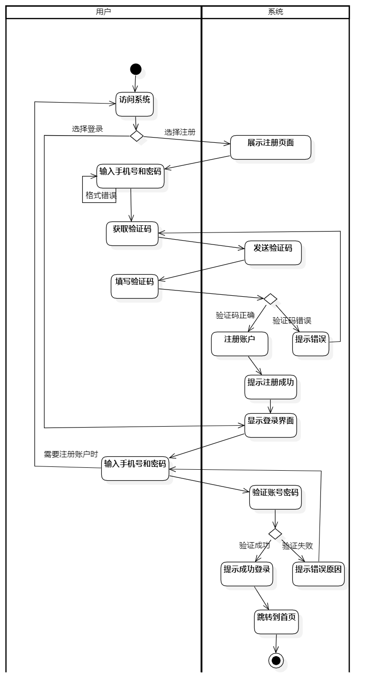

[TOC]

# 序言

## 预期读者

- 使用“糖小智”的糖尿病患者代表
- 糖尿病患者的主治医生代表
- “糖小智”饮食管理与营养评估系统开发、测试、运维人员

# 2. 项目驱动

##  项目目的

随着生活方式的变化和饮食结构的转变，糖尿病患者日益增多，对他们的饮食管理和控制的需求变得愈发迫切，然而传统食物营养计算需要较大的人力物力成本，且难以预估。此外，只依靠病人手动填报食物摄入量往往并不准确，而且通常不切实际，由此导致糖尿病人对食物营养摄入的估计常常产生偏差。在数据统计与分析方面，传统表格记录的数据统计和数字化费时费力，患者难以实时且直观地了解自己的血糖状况以及饮食摄入情况。

为了解决上述问题，为糖尿病患者提供能够直观便捷地掌握自身健康状况的分析工具，我们计划以赵钦佩导师"面向糖尿病患者异构数据的强化学习血糖管理控制模型"项目组所开发的基于图像实例分割算法、目标识别算法和深度估计算法所开发的食物营养评估模型为基础，参考《中国2型糖尿病防治指南(2020版)》《成人糖尿病食养指南（2023 年版）》等文献，开发一款能够为患者提供便捷化的饮食和数据记录方式、自动化的血糖和饮食数据分析、基于AI模型的食物营养评估等综合功能的饮食管理与营养评估系统

##  利益相关方

利益相关方为直接或间接从正在开发的系统中获益的人。

在本项目中，我们将利益相关方分为四个群体：程序员、高校科研项目组成员、医院方、患者

其中，程序员细分为系统开发人员、系统测试人员、系统维护人员；高校科研项目组成员分为项目主管教授、参与算法开发的学生；医院方分为决定系统采购的管理人员、接触患者的一线医生

通过对不同利益相关方的访谈，我们可以从不同角度获取详细的业务需求。如和教授及算法开发人员的访谈可以了解该算法的使用边界与使用方式，以及可以通过该算法获得的分析结果；通过与医院管理人员的交谈可以确定系统安全性、隐私性需求，获取糖尿病管控方面的领域知识与应用角度；通过与一线医生的访谈可以了解医生希望接待患者时快速获取到的患者健康信息与历史数据记录；通过与患者的交谈可以获取患者目前在糖尿病病情控制方面的困难、在数据记录方面的困扰，以及最终用户期望实现的系统功能，与此同时也可以为进行用户友好的系统功能与页面设计打下基础。

该项目的算法开发者为赵钦佩教授及其研究生团队，他们对所要开发系统的目标是能够作为项目组所研发算法的应用平台，在用户使用评估系统过程中收集评估系统的评估结果，测试算法的准确性以便进一步改进。

项目的院方代表为王从容主任，作为医生他们希望能够便捷地看到所接诊患者的过往血糖和饮食数据以便快速掌握患者的病情和饮食偏好情况

我们还采访了项目的患者代表，她希望系统能够简化目前繁琐的手动记录血糖和饮食数据过程，同时能够让病人快速获知各种食物的营养信息，以及直观地查看自己一段时间内的饮食和血糖状况。

##  项目背景

糖尿病是一种慢性代谢性疾病，更是一种并症风险极高的疾病。根据国际糖尿病联合会最新的研究报告，目前全球有 4.63 亿人患有糖尿病，而中国是糖尿病患者最多的国家。在中国，因糖尿病引起的心血管疾病、失明、肾衰竭和截肢等并发症导致的死亡率逐年上升，甚至已超过艾滋病、结核病和乳腺癌等疾病的死亡率。 

饮食控制是糖尿病患者管理和控制血糖的重要方法。据全球超过 5000 万名糖尿病患者的研究数据显示，保持良好的血糖控制，能够将糖尿病的并发症风险降低 30%至 70%。糖尿病患者的饮食以低糖、低脂、低盐、高纤维为原则，需控制摄入的总能量和碳水化合物的比例。

糖尿病患者的饮食控制面临诸多挑战。首先，糖尿病患者需要遵循以低糖为主的饮食原则，而这往往涉及到对食品的选择和分量的控制，且常常需要长期坚持，对患者的心理和生活习惯都要求较高。其次，部分糖尿病患者存在饮食习惯不良、慢性病知识欠缺、心理压力大等情况，增加了患者饮食控制的困难和复杂性。最后，食物分量需要仪器测量， 并且测量过后也只能得到每种食物的重量，无法直接得到营养成分含量，而后者对糖尿病人的进食更加重要。

## 需求调研

1. 用户调研：与上海市第四人民医院医生和患者进行深入交流后，了解到如下问题
   - 复杂的饮食计划：制定和遵循合适的饮食计划需要考虑碳水化合物、脂肪、蛋白质的摄入量，以及餐后的血糖波动。 但若是医生仅按各营养物质的摄入量给予患者建议，又很难去衡量和遵循
   - 食物选择的限制：医生所给出的食物清单比较有限，很难覆盖所有菜品，影响患者的饮食满足感，长此以往可能在心理和生理上都对糖尿病治疗产生负面影响
   - 数据记录的困难：传统的表格或简单的电子记录无法衡量详细指标，只能依赖拍照给医生进行评估，而繁琐的表格记录容易降低患者对医嘱的依从性，让治疗效果大打折扣
   - 饮食记录不及时和不直观：传统的表格记录难以可视化地对一段时间内的饮食做出分析，难以得到饮食和血糖变化的对应关系，数据分析和录入系统十分麻烦
2. 市场调研：目前市场上存在关于糖尿病患者饮食控制的app，但都存在以下共性问题
   - 针对性弱：在糖尿病诊治方面的针对性和专业性较弱。
   - 操作复杂：患者需要自行输入每餐摄入的碳水、脂肪、蛋白质等
   - 对接困难：患者及其主治医生很难通过app直接交流
   - 粒度粗糙：部分app的拍照识别食物功能无法准确估计食物的营养，帮助不大

## 系统需求

1. 营养成分评估
   - 用户要能够将摄入的食物拍照上传，或直接选择摄入的食物种类和数量
   - 系统需根据用户上传的图片自动识别出食物的种类，估算出各营养成分的含量并且向用户展示对应数据
2. 饮食信息记录
   - 系统需记录下用户每一餐的摄入的营养物质含量
   - 需提示用户进行饮食数据的上传
3. 数据分析
   - 系统需以图表形式向用户展示今日的血糖波动，并且在数据波动明显的地方，查询对应的饮食情况，标注出最可能导致血糖上升或下降的饮食行为
   - 系统需统计用户今日已摄入的营养物质含量（脂肪、蛋白质、碳水和卡路里），提示用户还可摄入的量
   - 系统需展示出当前血糖含量情况，给与用户不同的反馈。比如血糖含量上升明显时发出警告提示。
4. 食谱与食物查询
   - 用户可以在上传饮食信息时查看每一种食物对应的营养成分含量，便于调整饮食
   - 系统需提供适配糖尿病患者的食谱，便于用户查询，作为饮食指导。

## 系统功能描述

- 用户身份验证与管理
- 饮食记录与分析
- 健康食谱查询
- 营养评估与建议
- 血糖追踪与数据管理

## 系统协作与整体业务适应

- 设计用户友好的界面，方便糖尿病患者记录饮食信息、获取营养建议，并确保系统的稳定性和易用性。
- 该系统将作为支持糖尿病患者健康管理的一部分，与医疗机构的健康管理战略相契合，为病患提供更好的服务和关怀。系统提供长期的饮食管理和营养指导，为糖尿病患者提供持续的关怀和支持，符合组织关注患者长期健康状况的愿景。
- 允许用户选择性地分享饮食和血糖数据给医护人员，以便专业人员能够提供更专业的建议和指导。
- 作为数字化健康管理的一部分，该系统与组织长期推进的数字化战略相契合。它为患者提供了一个方便的数字平台，帮助他们管理糖尿病和饮食习惯。

# 3. 项目约束

##  强制性约束

###  解决方案限制

1. 接收用户的饮食信息应当基于图片来进行分析。
   - 基本原理: 用户不愿花费太多时间来进行记录饮食，太复杂的处理方式使得软件不可被用户接受。
   - 适应标准: 系统可以正确识别用户上传的图片中的内容，并进行正确合理的分析。
2. 具体业务逻辑的服务不能被客户端直接调取到，应当通过网关来进行转发。
   - 基本原理：具体业务逻辑的服务是受到保护的，信息安全性和服务稳定性需要得到保障，防止被错误或非法调用而影响到用户的隐私和系统的稳定安全。
   - 适应标准：在前端页面制作中，发送的请求直接发到网关，隐藏具体业务逻辑的服务地址，防止被恶意获取到。
3. 所有的信息应当提醒用户仅具有参考价值，不可作为专业或直接的判断依据。
   - 基本原理：首先在饮食识别上算法存在一定误判，识别信息不够准确；其次，人体的参数存在波动性，一定幅度内的不稳定是可以被接收的；最后，该系统设计之处只是一个辅助系统，帮助用户进行自我管理，记录日常数据，同时在就医时能够像医生提供更详尽的信息，协助医生进行诊断。
   - 适应标准：在页面中的信息不该具有误导性，同时显示信息提醒用户结论仅供参考。
4. 用户在自己的账号内，不得获取到他人信息。
   - 基本原理：不同用户的个人信息是受到保护的，个人信息具有隐私性，不得被非本人获取。
   - 适应标准：需要获取用户信息的请求，在后端进行鉴权，使得用户仅能获取到自己的信息，对非本人信息进行拦截阻止，具体判断依据从会话信息中获得。

###  预期的工作环境

- 在用户家庭等日常生活中使用记录个人饮食信息
- 用户在日常生活中监管和查看个人血糖变化
- 监督血糖状态，注意报警和提示信息
- 在每餐后拍照记录此次饮食的信息

###  日程约束与资金约束

针对现有功能的项目开发周期为四个月，时间为2024年3月-2024年6月

目前系统为学生开发，暂无资金支持。

##  术语表

- **糖尿病：** 一种慢性代谢性疾病，特征是身体无法正确使用或产生足够的胰岛素，导致血糖水平升高。
- **一型糖尿病：** 一种糖尿病类型，由于免疫系统攻击胰岛素产生的胰岛β细胞，导致胰岛素严重缺乏。
- **二型糖尿病：** 一种糖尿病类型，特征是身体对胰岛素的抵抗或产生不足，导致血糖升高。
- **胰岛素抵抗**： 细胞逐渐对胰岛素的反应降低，导致身体需要更多的胰岛素来维持正常的血糖水平。
- **并发症：** 长期高血糖可能导致的健康问题，如心血管疾病、神经病变和眼部问题等。
- **血糖反应：** 食物引起的血糖水平的变化，通常用于评估食物对血糖的影响。
- **餐后血糖：** 进餐后一定时间内测量的血糖水平，用于评估食物对血糖的直接影响。
- **糖负荷：** 食物引起的血糖升高的相对大小，考虑了食物的碳水化合物含量和血糖指数。
- **蛋白质：** 身体组织和细胞的基本构建块，对于维持肌肉质量和修复组织非常重要。
- **脂肪：** 一种提供能量的营养物质，对于维持体温、保护器官和吸收脂溶性维生素至关重要。
- **碳水化合物**： 身体主要能源来源，包括单糖、双糖和多糖，分别存在于水果、蔬菜、谷物和糖中。
- **纤维素：** 一种无法被人体消化的碳水化合物，有助于维持肠道健康和控制血糖。
- **血糖指数**： 食物中碳水化合物对血糖的影响程度的衡量标准，有助于选择对血糖影响较小的食物。
- **总能量摄入：** 患者每日摄入的总能量，通常以卡路里为单位，包括蛋白质、脂肪和碳水化合物。
- **基础代谢**： 是指人体维持生命的所有器官所需要的最低能量需要。
- **BMI指数**： 是国际上常用的衡量人体胖瘦程度以及是否健康的一个标准。

$$
\begin{equation} 理想BMI=体重（kg）/身高（m）^2 \end{equation}
$$

**体脂率：** 体脂率是指人体内脂肪重量在人体总体重中所占的比例，又称体脂百分数，它反映人体内脂肪含量的多少。

- **血糖生成指数**（**GI**）：指某种食物升高血糖效应与标准食品（通常为葡萄糖）升高血糖效应的比值，代表的是人体食用一定量的某种食物后会引起多大的血糖反应。它通常反映了一个食物能够引起人体血糖升高多少的能力。 低GI食物，在胃肠中停留时间长，吸收率低，葡糖释放缓慢，血糖波动较小，同时也让人产生饱腹感。而高GI的食物，进入胃肠后消化快、吸收率高，更容易感到饥饿。

$$
GI =(摄入含 50g 碳水化合物食物的餐后血糖曲线下面积)/(摄入 50g 葡萄糖的餐后血糖曲线下面积)× 100
$$

$$
\begin{equation} 血糖曲线下的面积 = 1 /2( 空腹血糖 + 餐后 3h 血糖) + 餐后 1h 血糖 + 餐后 2h 血糖 \end{equation}
$$

- **食物的血糖负荷**（**GL**）：通常用来评价某种食物摄入量对人体血糖影响的幅度。它结合了食物的血糖生成指数（GI）和实际摄入的碳水化合物量。

$$
\begin{equation} GL=（食物的碳水化合物含量（每100克）×GI）/100 \end{equation}
$$

- **NRV**%： 指营养素参考值百分比，表示100克或100毫升食物所含的的某种营养成分，提供了人体一天需求量的百分比。
- **TIR：**葡萄糖达标时间百分比，具体来说就是要求患者在一天24小时内，血糖中葡萄糖浓度在目标范围内（通常为3.9~10.0mmol/L）的时间或其所占的百分比。

##  相关事实和假设

###  相关事实

1. 现有基于图像实例分割算法、目标识别算法和深度估计算法所开发的食物营养评估模型。
2. 现有基于287种中餐食物的食物营养数据集。
3. 具备与上海市第四人民医院糖尿病专家王从容主任进行对接，包括对患者进行需求调研的条件。
4. 《2020年*糖尿病*诊疗标准》指出,血糖目标范围时间(*TIR*)是反应患者血糖稳定性、*监测*并发症的重要*指标*。
5. 《成人糖尿病食养指南（2023版）》给出了食物多样、能量适宜、主食定量、积极运动、清淡饮食、食养有道、规律进餐、自我管理等八条食养原则和建议

###  业务规则

1. 患者需要将每一餐的饮食进行记录
2. 患者的连续血糖监测仪每15分钟上传一次血糖数据（也可以进行手动记录，人工记录则一日监测4-7次）
3. 由于糖尿病患者饮食的特殊性，进食不仅限于正餐，存在加餐情况也需要进行记录
4. 患者不定期查询任意时间段的血糖和饮食数据
5. 食物库分为系统库（使用科研项目组数据集）和用户自定义库（允许用户自定义添加食物）两部分
6. 根据《成人糖尿病食养指南（2023版）》进行适合糖尿病人的食谱的整理和显示

###  假设

1. 后端可以提供所需要的用户数据
2. 饮食营养评估模型可以正确识别用户上传的饮食图片中的各食物的营养成分含量
3. 系统可以在拍照上传后记录下营养成分含量，并且进行相应的数据展示
4. 用户一次性会查看时间跨度小于24h的血糖和饮食数据
5. 用户希望获取单日TIR及某一次引起血糖超过阈值的事件

# 功能需求

##  工作范围

###  现状分析

饮食管理与评估系统目前的现状是糖尿病患者需要手动记录饮食信息和血糖数据。一些患者可能使用纸质日记或简单的电子表格来记录食物摄入和血糖读数。这种手动记录的方式存在一些局限性，包括数据不够准确、管理不便、无法提供实时反馈等问题。此外，存在一些自动化记录的工具或应用，但它们可能缺乏个性化的营养评估功能或不够用户友好。

###  工作背景

目前，许多糖尿病患者需要手动记录饮食信息和血糖数据。这种记录方式可能包括使用纸质日记、电子表格或一些简单的应用程序。然而，这种手动记录的方法存在一些挑战，包括数据不准确、管理不便，无法提供实时反馈等问题。同时，一些现有的应用程序提供了部分功能，但可能缺乏个性化的营养评估和专业的医疗指导。

饮食和营养对于糖尿病患者的管理至关重要。科学合理的饮食管理可以有助于控制血糖水平，减少并发症风险，提高生活质量。因此，构建一个系统，能够帮助患者更好地管理饮食、获得个性化的营养评估和专业医疗建议，对于糖尿病患者是非常重要的。

针对糖尿病患者的饮食管理与评估系统的建立旨在解决现有手动记录和部分应用程序所存在的问题，提供更全面、个性化的营养评估和医疗建议。

###  工作划分

用户录入饮食信息

- 描述： 用户使用系统录入他们每日的饮食信息，包括食物种类、摄入量和时间。
- 响应： 系统应记录并储存用户输入的饮食信息，并在需要时进行分析。

系统分析用户饮食数据并生成营养评估报告

- 描述： 系统定期或根据用户请求分析录入的饮食数据，并生成相应的营养评估报告。
- 响应： 系统使用预先设定的算法对用户的饮食数据进行分析，生成个性化的营养评估，并向用户展示结果。

###  业务用例规范

| 事件名称             | 输入                                     | 输出                                                         | BUC摘要                                                      |
| -------------------- | ---------------------------------------- | ------------------------------------------------------------ | ------------------------------------------------------------ |
| 用户录入饮食信息     | 用户录入的饮食信息                       | 保存在系统数据库中的用户饮食记录                             | 用户可以通过系统界面录入其每日饮食信息，系统保存并管理这些记录。系统根据输入的数据生成营养评估报告。 |
| 搜索推荐食谱         | 用户输入的搜索关键词或选择的特定饮食偏好 | 推荐的食谱列表或建议的饮食方案                               | 用户可以通过系统界面输入关键词或选择特定的饮食偏好，系统根据这些信息搜索并推荐相应的食谱或饮食方案。 |
| 查询食物             | 用户输入食物名称或食物类别               | 食物列表                                                     | 系统根据检索关键字匹配出若干符合输入要求的食物，将食物信息展示给用户 |
| 查询血糖数据分析结果 | 血糖时间范围                             | 该时间范围内的血糖数据波动图及各时间段占比环状图、该时间范围内的最高、最低、平均血糖值 | 用户可以查询时间跨度为24h范围内的血糖数据并查看分析结果      |
| 查询饮食记录分析结果 | 饮食时间范围                             | 该时间范围内的饮食记录及各营养物质摄入占比                   | 用户可以查询时间跨度为24h范围内的饮食数据并查看分析结果      |

##  功能性需求

###  登陆注册

需求编号：001

功能描述：系统提供注册和登录功能，允许用户通过手机号进行注册，通过密码或验证码进行登录。

优先级：高

验收标准：在注册模块，用户可以输入手机号、用户名、密码，点击发送验证码后用户手机上可以收到验证码。填入验证码信息并确认后可以注册成功并跳转回登陆页面；登录界面允许用户使用账号密码登录，或使用手机号发送验证码登录

###  记录饮食与营养评估

需求编号：002

功能描述：允许用户记录每一次的饮食，提供自定义输入和系统自动分析两种上传方法。

优先级：高

验收标准：系统提供日期功能，提供类型（早餐、午餐、晚餐还是加餐）选择按钮（如果是从首页早午晚餐记录入口进入，则这个字段应默认填写）

记录饮食时，用户可以点击拍照上传，提供一个输入框输入图片中的食物种类数量，然后点击开始分析。页面弹窗显示“分析中”，分析结束后提醒用户选择匹配度最高的食物，弹窗里提供每种食物识别的最可能的五种结果下拉菜单（菜单里内容由后端算法分析后返回给前端），让用户选择最符合的食物。用户点击确定后图片上传系统自动分析出营养物质含量，在下面显示营养物质分析结果。

如果用户不选择自动营养评估，也可以手动填写数据。

用户点击提交，则生成一条饮食记录。

提供饮食预警，若当天摄入卡路里超过警戒阈值，将在显示警告信息。

显示当天还可以摄入多少千卡、各营养物质当天摄入了多少，通过进度条显示。

计算方式采用《中国2型糖尿病防治指南（2020年版）》中推荐的计算方法。

营养物质考虑四种：脂肪、蛋白质、碳水、纤维素。

提供三餐+加餐记录按钮（显示此次用餐评估的卡路里数，点击之后跳转到详细记录页面，允许更改）。

###  数据分析

需求编号：003

功能描述：允许用户选择某一天的血糖和饮食数据进行展示。对于血糖数据，给出血糖波动图，及所选时间范围内TIR值；对于饮食，给出当日饮食记录条目及所摄入各种营养的比例

优先级：高

验收标准：允许选择时间范围

提供两个入口：血糖数据和饮食数据

数据分为若干呈现形式：表格、折线图、饼图

折线图下面给出动态血糖检测目标范围时间TIR比例：低血糖、目标范围、高血糖、超高血糖、极高血糖，下面使用环形图更明显地显示各时段占比。以及当天血糖平均值、最低值、最高值

页面下方给出不同范围的血糖的目标区域时间占比的标准值，比如(3.9-10.0]应大于70%，具体百分比多少根据用户填写的糖尿病类型进行判断。

用户可以点击数据上的点查看血糖信息和饮食信息

因为血糖15min记录一次，一天的记录量比较大，因此允许折线图左右滑动，坐标固定

显示血糖超标不同严重程度范围，使用不同颜色标识

当用户点击折线图上的点，应弹窗显示血糖事件和饮食事件，即点开后的内容。

血糖事件点击之后显示内容为：时间（年月日时分）、血糖值、提示

**提示分级：**

提示内容为：

蓝色：<=3.9:您的血糖值处于低血糖范围

绿色：在(3.9-7.0]（空腹血糖正常值）：您的血糖处于正常范围

绿色：在(7.0-10.0]（餐后血糖正常值）这里要查询该时间前两小时是否有进食：

如果有：您的血糖处于餐后血糖目标范围。

如果没有：未检测到您在前两小时内有过进食，该血糖值偏高，需要您注意身体状况

黄色：在(10.0-13.9]：您的血糖值超出正常范围，存在风险

橙色：在(13.9-16.7]：您的血糖值超出正常范围，风险较高

红色：>16.7：您的血糖值超出正常范围，糖尿病酮症酸中毒风险极高，建议尽快就医

如果当前血糖处于非目标区间，则通过按钮可以点击查看风险事件，点开后弹窗显示该时间前两个小时的饮食记录

###  **食物查询**

需求编号：004

功能描述：允许用户按照食物名称、食物类别、是否自定义进行查询，允许用户查看食物的详细营养信息。

优先级：高

验收标准：用户按照食物类别/食物名称进行查询，名称使用模糊匹配。将数据集的食物数据和用户建立的独属于该用户的食物库进行分离。对于每一种食物，用户点击后可以查看食物详细的单位质量营养物质等食物信息。数据来源为同济大学软件学院面向糖尿病患者异构数据的强化学习血糖管理控制模型项目组所构建的数据集。

###  食谱查询

需求编号：005

功能描述：在食谱查询页面，用户可以选择感兴趣的食谱进行查看，但不强制用户按此食谱进行每日食物摄入计划，仅作建议

优先级：较高

验收标准：用户可分全国各地区（如东北、华北、西北、华南、华东等）以及适合季节查看所推荐的食谱，食谱参考来源为《成人糖尿病食养指南（2023）版》

# 非功能需求

##  **性能需求**

- 系统应在用户请求后迅速响应，保持良好的交互性。能够快速地识别用户拍摄的食物图片，并返回相应的食物名称、重量、体积和营养成分等信息，以提供高效的用户体验。
- 系统应能够记录和分析用户的饮食数据，并将其可视化地展示给用户和医生，以便于监测和评估用户的饮食状况，用户数据保存在Mysql数据库中，能够长期持久化、正确得保存数据，在处理大文件时，使用Minio来作为对象存储服务，将大文件正确存储到磁盘上长期保存。
- 系统应能够稳定地运行在移动设备上，避免出现闪退、崩溃等不可接受的错误。
- 系统应能够支持一定量用户同时在线使用，不出现崩溃或延迟过高的情况，在前端使用nginx来对请求进行负载均衡，提高系统的并发度，确保系统高可用，在后端将服务进行集群化部署确保系统的高可用性。
- 系统应能够迅速、准确地处理用户上传的饮食数据，进行营养评估和生成个性化饮食计划。

##  **质量需求**

- 准确性：系统提供的饮食评估和建议应当准确无误，能够准确地识别用户拍摄的食物图片，通过科学的算法和数据库支持，确保用户获取到的信息和建议符合糖尿病管理的专业标准，不会出现误识别、漏识别等情况。
- 可靠性：系统应保持稳定性，避免出现崩溃、死锁等问题，能够在用户需要时提供服务，定期进行系统巡检和维护。对输入有提示，数据有检查，防止数据异常。系统健壮性强，应该能处理系统运行过程中出现的异常情况。
- 一致性：能够保证系统内部和外部的数据和信息的一致性，不会出现数据冲突、信息不同步等情况。在用户登录这一步，我们通过使用Redis来实现单点登录，在确保用户身份信息安全性的同时，保证了在多个服务中重复登录的繁杂问题，提高了用户的使用体验，同时保证了用户的登录信息是一致性的。

##  **安全需求**

- 数据隐私： 系统应能够保护用户的隐私和数据安全，用户的个人健康数据和饮食记录应得到严格保护。在存储过程中采用加密手段，确保不会泄露用户的个人信息、病历信息、饮食数据等敏感信息。并且防止未经授权的访问，只有经过授权的用户和医生才能够访问和操作系统中的数据和信息。对于客户端请求必须在验证登录之后才能正确访问，对于密码使用加盐和md5的加密算法提高安全性，基于Sa-Token插件管理用户登录的访问会话，登录成功获取到的令牌有4小时时效性，过期之后失去效果。所有的访问必须经过网关层验证登录的合法性才能被转发给下一层，否则将被直接拦截请求，无法访问到下一层的服务。
- 用户身份认证： 系统应严格权限访问控制，能够防止非法的访问和操作，用户登录时应进行身份验证，确保只有授权用户才能访问系统。并且不同的用户具有不同的身份和权限，需要在用户身份真实可信的前提下，提供可信的授权管理服务，保护数据不被非法访问和篡改。使用Sa-Token来对系统整体进行权限认证，在访问过程中通过拦截器对请求身份进行验证确保身份正确性和安全性。

##   **用户友好需求**

- 界面友好性： 系统界面应清晰、简洁、美观，方便用户的使用和操作，易于操作。提供直观的导航和信息展示，确保用户能够轻松理解和使用系统功能。
- 帮助和指导： 系统应能够提供完善、详细、易懂的帮助文档和指导信息，帮助用户解决使用中的问题和困难。以解答常见问题和引导用户正确使用系统，提高用户满意度。
- 用户交互设计：能够提供友好、及时、有效的反馈，增强用户的使用体验和满意度。并且系统应具有良好的用户适应设计，能够根据用户的使用习惯和喜好，进行个性化的设置和调整，满足用户的不同需求。

##  **可维护性需求**

- 文档设计：能够提供规范、完整、准确的文档，包括需求文档、设计文档、测试文档等，方便系统的开发、测试和维护。
- 标准设计：能够遵循统一的编码规范、命名规范、注释规范等，保证系统的可读性和可维护性，在开发过程中，各项规范符合《阿里巴巴Java开发手册》的规范。
- 模块设计： 系统应具有良好的模块化设计，能够将系统分解为多个相对独立的模块，降低系统的复杂度和耦合度，提高系统的可理解性和可扩展性，方便对不同功能模块进行单独的更新和维护，降低系统维护的难度。
- 日志记录： 系统应具备完善的日志记录功能，记录关键操作和异常情况，以便及时发现和解决问题，每个微服务都保存有内部操作日志，在出现问题时能够通过查看日志发现问题和研究问题的原因。
- 定期更新： 系统应定期进行软件和数据库的更新，以适应新的技术发展和用户需求，提升系统的性能和功能。
- 拓展性好：使用到微服务架构后，可以简单粗暴得通过堆叠服务来提高系统的高可用性和高并发性，使用Nacos来对服务进行管理，在服务注册到系统中后，会自动识别和发现服务，并且对服务进行负载均衡。

##  法律要求

需要遵循《中华人民共和国个人信息保护法》《中华人民共和国网络安全法》《APP违法违规行为认定方法》等，并根据《移动互联网应用程序app收集使用个人信息自评估指南》进一步规范

- 是否公开收集使用个人信息的规则
- 是否明示收集使用个人信息的目的、方式和范围
- 是否征得用户同意后才收集使用个人信息
- 是否遵循必要原则，仅收集与其提供的服务相关的个人信息
- 是否经用户同意后才向他人提供个人信息
- 是否提供删除或更正个人信息功能，或公布投诉、举报方式等信息

# 系统模型

##  用例总图

##  注册登录用例

###  用例图

###  用例规约

| **属性** | **简要描述**                                                 |
| -------- | ------------------------------------------------------------ |
| 名称     | 注册登录                                                     |
| 简要描述 | 用户登录系统前，需要进行登录操作，若没有相应账号需要进行注册操作 |
| 基本流   | 用户访问到系统界面系统显示登录/注册界面用户选择进行登录或者注册操作用户选择注册操作，并输入账号密码系统验证账号密码是否符合规范，并给出相应提示用户点击获取验证码按钮系统向指定手机号发送短信用户填写收到的验证码系统检验验证码是否正确，并给出提示系统提示注册成功，并跳转到登录界面用户选择进行登录操作，并输入账号密码系统验证账号密码是否正确，若错误则给出错误原因提示用户重新输入系统提示登录成功并跳转到首页 |
| 可选流   | 用户若已有账号密码时要能够跳过注册操作                       |
| 异常流   | 用户输入的账号或密码不符合规范，则系统显示相应的错误信息，提示用户重新输入。用户获取验证码时出现错误，则系统提示验证码发送失败，用户可以选择重新发送。用户填写的验证码不正确。系统提示验证码错误，用户可以重新填写 |
| 特殊需求 | 无                                                           |
| 前置条件 | 用户访问系统界面                                             |
| 后置条件 | 用户成功登录系统，并进入首页                                 |
| 扩展点   | 可以增加找回密码操作可以增加双因素身份验证                   |
| 关系     | 登录/注册是整个系统使用的初始步骤，为后续操作提供了身份验证  |
| 图表     | 用例图、泳道图                                               |

###  泳道图

**文字描述：**

1. 用户首先访问到系统界面
2. 系统显示登录/注册界面（默认登陆页面）
3. 用户自行选择进行登录或者注册操作
4. 若用户选择注册操作，则系统跳转到注册页面
5. 用户输入账号密码后，系统需要进行验证是否存在格式错误，若存在则提示用户更正，直到输入符合规范的账号密码
6. 用户点击获取验证码按钮
7. 系统向指定手机号发送短信
8. 用户填写收到的验证码
9. 系统检验验证码是否正确，并给出提示
10. 系统向后端发送用户的账号密码并注册该账户
11. 系统提示注册成功，并跳转到登录界面
12. 用户选择进行登录操作，并输入账号密码
13. 系统验证账号密码是否正确，若错误则给出错误原因提示用户重新输入
14. 系统提示登录成功并跳转到首页

##  营养成分评估用例

###  用例图

###  用例规约

| **属性** | **简要描述**                                                 |
| -------- | ------------------------------------------------------------ |
| 名称     | 营养成分评估                                                 |
| 简要描述 | 用户上传食物，系统评估各营养物质的含量并记录饮食             |
| 基本流   | 用户登录系统用户选择上传饮食记录系统跳转到饮食记录上传页面用户选择上传方式若选择手动上传食物信息，则选择对应的食物名称并且选择重量系统需根据克数评估营养成分含量若用户选择拍照上传系统返回最相似的食物用户选择对应的食物并确定系统根据用户的选择，进行营养评估并显示各营养成分含量用户确认保存食物系统将本次饮食信息记录 |
| 可选流   | 在确认保存饮食记录前的任何阶段，用户均可退出                 |
| 异常流   | 若手动选择食物时没有找到对应的食物或系统返回的食物图片中没有对应的食物时，用户要能够选择添加食物信息；系统要将用户添加的食物信息保存到数据库系统响应超时，需给予用户提示系统保存饮食记录失败，系统应提示用户重新保存 |
| 特殊需求 | 用户可以多次上传食物用户查看各食物营养成分含量               |
| 前置条件 | 用户登录到系统，并且系统查询到该用户信息                     |
| 后置条件 | 系统将饮食营养成分评估的结果保存到系统中                     |
| 扩展点   | 在步骤10中可以增加修改营养成分评估结果的附加操作             |
| 关系     | 与用户之间的交互，系统需要与图像识别和数据库模块进行通信     |
| 图表     | 用例图、泳道图                                               |

###  泳道图

文字说明：

1. 用户登录系统
2. 用户选择上传饮食记录
3. 系统跳转到饮食记录上传页面
4. 用户选择对应的食物名称并且选择重量
5. 若没有找到对应的食物，可以选择添加食物
6. 系统需根据克数评估营养成分含量
7. 用户也可以选择拍照上传
8. 系统返回最相似的食物
9. 用户选择对应的食物图片并确定
10. 若没有对应的食物，同样可以添加相应的食物
11. 系统根据用户的选择，进行营养评估并显示各营养成分含量
12. 用户可以多次上传食物
13. 用户可以查看当前待上传食物的总的营养成分含量
14. 用户确认保存食物
15. 系统将本次饮食信息记录
16. 用户在确定保存之前的任何阶段均可退出上传

##  数据分析用例

###  用例图

###  用例规约

| **属性** | **简要描述**                                                 |
| -------- | ------------------------------------------------------------ |
| 名称     | 数据分析                                                     |
| 简要描述 | 系统根据用户上传的饮食和血糖记录，评估血糖波动与饮食的关系，绘制相应图表，并提示用户血糖含量和食物摄入量 |
| 基本流   | 用户登录系统系统查询用户的血糖和饮食信息，并综合分析饮食和血糖波动的关系系统进行血糖波动分析并展示近期血糖和饮食数据用户选择查看详细数据系统进入数据分析页面用户选择要查看的时间范围用户选择查看的数据类别若用户选择查看血糖数据，则系统根据时间范围展示出血糖波动和风险事件若用户选择查看饮食数据，则系统根据时间范围展示出饮食中营养成分含量 |
| 可选流   | 用户可以不同数据类型之间切换用户可以在查看数据时切换时间     |
| 异常流   | 若无法查询到用户的血糖和饮食数据，系统需给出提示信息，提示用户上传用系统响应超时，需给出提示信息 |
| 特殊需求 | 系统应快速响应用户的操作                                     |
| 前置条件 | 用户已成功登录系统，并且有可用的血糖数据                     |
| 后置条件 | 用户成功完成血糖数据分析，系统返回到主界面                   |
| 扩展点   | 无                                                           |
| 关系     | 与营养成分评估用例存在关系，数据分析的数据均来自用户上传饮食的营养评估 |
| 图表     | 用例图、泳道图                                               |

###  泳道图

文字说明：

1. 用户登录系统
2. 系统查询用户的血糖和饮食信息，并综合分析饮食和血糖波动的关系
3. 系统在首页展示出最近一段时间的血糖波动折线图和饮食、血糖情况的情况预警（比如当前血糖含量较高等提示），以及今日是否上传血糖记录，是否上传饮食记录等，并显示今日还可摄入的各种营养成分的量
4. 用户选择查看详细数据
5. 系统进入数据分析页面
6. 用户选择要查看的时间范围
7. 用户选择查看的数据类别（血糖、饮食数据）
8. 若用户选择查看血糖数据，则系统根据时间范围展示出血糖波动图，不同的血糖范围用不同的颜色标识，并且并且计算出当前时间范围内处于不同血糖范围的比例
9. 若用户选择查看血糖数据，并且选择查看某个点的风险事件，系统需要展示出引发当前血糖波动最有可能的饮食情况
10. 若用户选择查看影视数据，则系统根据时间范围展示出饮食中各营养成分的饼图

##  食谱查询用例

###  用例图

###  用例规约

| **属性** | **简要描述**                                                 |
| -------- | ------------------------------------------------------------ |
| 名称     | 食谱查询                                                     |
| 简要描述 | 用户可以进入推荐的食谱并查看详细的食物营养信息               |
| 基本流   | 用户登录系统用户选择食谱查询功能系统跳转到食谱查询界面系统展示当前的食谱信息用户选择食谱系统展示选中的食谱的详细信息用户可以输入想要查询的食物，并查询其营养成分含量系统向用户展示查询的食物的营养成分 |
| 可选流   | 用户可以在任何时候退出查询操作                               |
| 异常流   | 用系统响应超时，需给出提示信息若无法查到对应的食物信息，需给出提示信息 |
| 特殊需求 | 推荐的食谱中的食物信息必须存在于数据库中                     |
| 前置条件 | 用户已成功登录系统                                           |
| 后置条件 | 用户成功查看食谱信息，系统返回到主界面                       |
| 扩展点   | 在步骤6中，用户应能够保存或者收藏查询到的食谱                |
| 关系     | 无                                                           |
| 图表     | 用例图、泳道图                                               |

###  泳道图

文字说明：

1. 用户登录系统
2. 用户选择食谱查询功能
3. 系统跳转到食谱查询界面
4. 系统展示当前的食谱信息
5. 用户选择食谱
6. 系统展示选中的食谱的详细信息
7. 用户可以输入想要查询的食物，并查询其营养成分含量
8. 系统向用户展示查询的食物的营养成分

##  食物查询用例

###  用例图

###  用例规约

| **属性** | **简要描述**                                                 |
| -------- | ------------------------------------------------------------ |
| 名称     | 食物查询                                                     |
| 简要描述 | 用户可以选择查询某种食物的营养成分含量                       |
| 基本流   | 用户登录系统用户选择食物查询功能系统跳转到食物查询界面用户输入要查询的食物名称系统显示该食物的营养成分含量 |
| 可选流   | 用户可以在任何时候退出查询操作用户应该要能够进行多次查询操作 |
| 异常流   | 用系统响应超时，需给出提示信息若无法查到对应的食物信息，需给出提示信息 |
| 特殊需求 | 根据用户输入在数据库中进行模糊匹配                           |
| 前置条件 | 用户已成功登录系统                                           |
| 后置条件 | 用户成功查看食物信息                                         |
| 扩展点   | 可以增加用户自定义食物的操作                                 |
| 关系     | 无                                                           |
| 图表     | 用例图、泳道图                                               |

###  泳道图

**文字描述：**

1. 用户登录系统后选择食物查询后系统跳转到食物查询界面
2. 用户输入要查询的食物名称后系统显示该食物的营养成分含量
3. 用户可以进行反复的查询操作

# 8.  项目问题

##  未解决问题

- 食物营养分析算法的响应时间过长，可能会导致用户体验不佳。
- 识别图像中食物的营养的信息的准确度不够高，这部分需要优化。
- 项目的部署过程略微繁琐，需要注意到的细节较为繁杂。
- 不同服务的管理较为分散，不方便稳定性维护。
- 整个系统中信息和数据较为单一，覆盖到的方面较窄，不能给用户提供非常完整和详尽的信息。

##  现有解决方案

- 针对算法精度不足和耗时过长的问题，我们有多个解决问题的方向。首先，导师团队针对算法进行优化和调整，完善算法内容以解决问题。其次，阿里云有提供类似的AI识别食物内容及热量的内容，可以和阿里云对接，稍微调整一下算法内容增加我们所需的参数信息就能达成我们的需求。最后，就是在硬件上，使用更加强力的核心，提高显存容量、核心频率和并发度等。
- 服务的部署首先可以提供相应的部署文档，然后也可以将服务使用docker-compose打包成镜像一键部署，这是这样可能会由于使用到docker的容器化技术损失一些服务器性能。

##  风险

- 服务器若被攻击如DDOS攻击，无法为用户提供优质服务，严重或将导致服务宕机。
- 用户隐私信息的安全性或不能被保障，存在被盗取的风险。
- 在系统中为用户提供的建议和意见可能无法被用户正确理解，存在信息误差，导致无法预计的后果。

##  成本

- 服务部署在云端服务器，使用云服务商提供的云端服务需要购买其服务。
- 服务的日常维护和监督需要人员管理。
- 在出现突发状况时，如服务宕机时，需要技术人员进行错误排查和修复。
- 在用户使用时，若存在错误信息或用户没有正确理解的操作，需要客服人员进行指导。
- 服务进行迭代更新时，需要技术人员完善开发和添加功能。