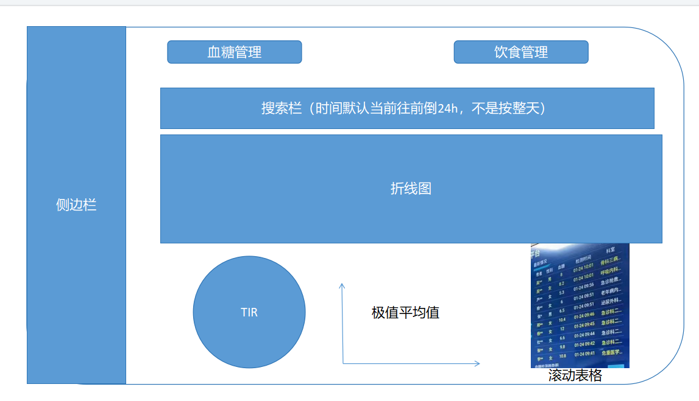
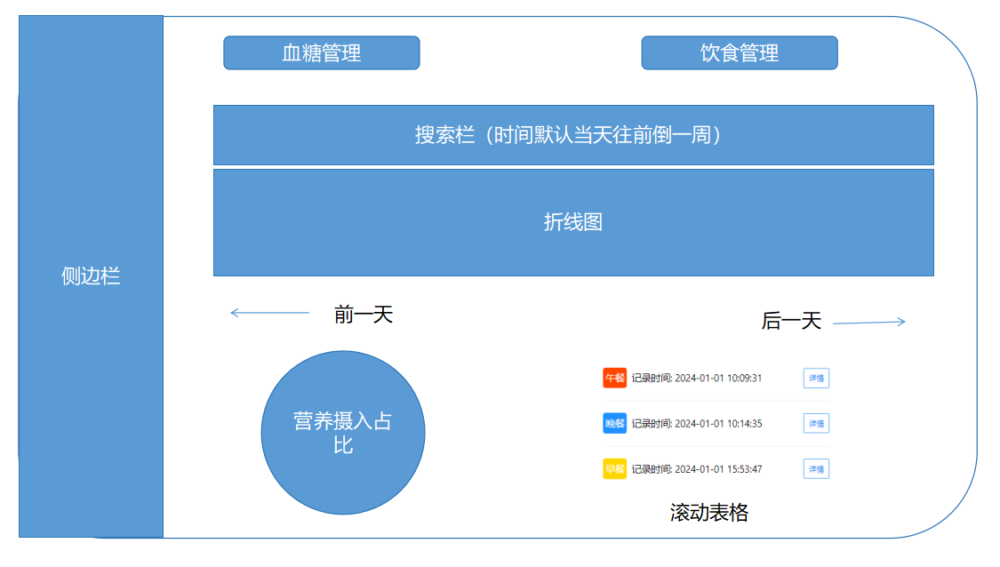

# 0321

图片识别、营养识别                chj：前端                      刘冲：java后端 go后端**（已完成）**

修改密码                                   dym：前端                      rzx：java后端**（已完成）**

加百度识图、大模型                丁：纯前端**（2024.4.25 已完成）**                         

血糖预测                                    zmc：前端      cjr： java后端**（后端已完成）**

文件上传                                    zmc：前端       cjr：java后端**（2024.4.29 已完成）**

改食谱界面、血糖分析数据界面

服务器迁移**（已完成 ）**

跑java后端**（已完成）**

对图片识别、营养估计算法**（已完成）**

# 0328

用户身体数据修改、查看**（2024.4.28 已实现 chj）**

前端： 丁一珉  血糖和饮食数据修改、删除**（后端已实现）**

上传头像、修改**（前端chj 2024.4.25   后端cjr 2024.4.25）**

版本更新

饮食加全部

# 0411

下节课汇报需求文档

本周完成血糖预测和文件上传后端接口编写

到下周之前完成后端大部分工作

下周讨论医生端搭建，移动端前端继续推进

# 0418

角色鉴权**（后端cjr 完成日期：2024.4.25）**

医生端：

医生、患者 互相选择（医生选直接通过   消息通知消息队列？rzx）**（2024.5.21）**

展示患者数据：

医生导入数据（文件上传 ）**（后端已完成）**

项目收获、遇到的问题

服务器

比较不同方案

下周任务：

头像修改、用户数据修改前端 chj **（2024.5.9 已完成）**

医生端微服务搭建 cjr **(已完成 2024.4.29)**

# 0428

下次课前任务：

大模型页面美化 dym

修改血糖预测和饮食评估算法bug cjr**（2024.5.12 已完成）**

# 0512

## 患者端

设置页添加一行记录所属的医生，页面进去显示医生的信息（姓名、性别、电话、科室、职称、个人简介、照片）

## 医生端：

侧边栏：

**患者管理、个人信息管理**

### 患者管理

登录进去首页展示所有已添加的患者信息，上方有搜索框（搜索患者姓名）

输入手机号或者姓名添加患者

首页标注过去24h有异常数据的患者

#### 血糖界面

点进去默认当前往前24h的数据，时间允许自己选，跨度**固定一天**

#### 饮食界面

折线图展示当前时间往前推一周的时间

营养占比和每一餐信息展示折线图对应这一周的最后一天（即折线图上的最后一天）

有两个按钮可以左右切换天数，如果往前或者往后（往后不能晚于当前时间）超出了折线图展示的时间，则折线图也切到再往前/往后的一周。

个人信息管理

医生端加设置界面（姓名、性别、电话、科室、职称、个人简介、照片）

获取医生管理的所有患者个人信息

对于某一个患者：

查看某一天血糖数据

预测当天血糖数据

上传血糖文件

异常数据提醒

查询某天饮食记录

某天的营养统计

周报？

# 0526

医生添加、删除患者

患者查看所属医生信息

医生查看其他医生信息

**（以上已完成 cjr 2024.5.27）**

# 0530

message字段——id sourceid destinationid type content time confirmed

chat字段——id sourceid destinationid type content time 

发送消息——对方展示，同时后台记录

查看历史消息——前端主动调

starttime endtime（前后跨度不超过6h）

只给starttime （适用于按天查询历史记录）

聊天：先获取历史消息（100条）有新的往下加，同时后端缓存进redis

新增用户弹窗

医生端：

饮食七天限制取消

饮食记录详情

患者端：

饮食记录报错bug

message必带字段：fromid toid

# 0613

任务安排：

cjr：使用文档、部署文档、pre准备

chj：前端测试

dym：医生端通知聊天

zmc：患者端通知聊天收尾、PPT

rzx：读书笔记

PPT:

cjr

项目简介

需求调研

架构图

部署图

数据库关系模式图

亮点：微服务、算法（图像识别、深度估计、血糖预测、websocket）、测试

chj

功能截图（罗列）

团队协作(聊天记录截图+github提交记录)

部署文档（cjr在写，到时候截张图）

使用文档（cjr在写，到时候截张图）

学习心得（rzx的读书报告截图+大家的心得，现在大家可以往各自的技术文档里写一下心得之类的，比如各自负责模块编程过程中需要注意哪些普适性问题，软件开发过程中要注意什么之类的经验教训）

技术文档（大家各自的技术文档，截两张图就行）

分工及排序：（

陈嘉瑞：系统需求分析与架构设计、任务分配、团队沟通、确定功能点、后端整体架构代码编写与测试、后端系统部署；

陈华机：项目任务协调、算法对接调试、患者端前端架构功能实现、医生端架构与患者页面、前端整体测试；

丁一珉：医生端前端大部分功能实现、患者端前端数据分析与AI咨询功能；

张铭宸：患者端血糖文件上传、血糖预测结果展示、通知聊天功能；

任喆轩：技术调研、websocket消息通信功能、技术文档与接口使用规范编写。

）

