# 患者端

## 登陆注册

进入系统后点击“开始”按钮

### 登录

在登录页面输入账号和密码后点击“登录”按钮即可登录。如果没有账号，点击“去注册”按钮

### 注册

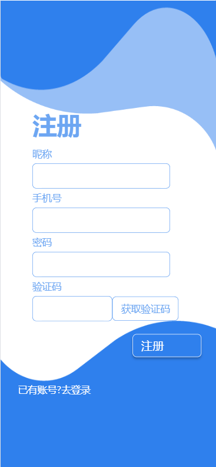

在注册页面，输入昵称、手机号、密码，之后点击获取验证码，将会有验证码发送到所注册的手机号上。注意这个手机号之前必须还未注册过本系统，即不可重复注册。输入验证码后点击注册即可注册本系统。

之后点击“去登录”，返回登录界面。

## 首页

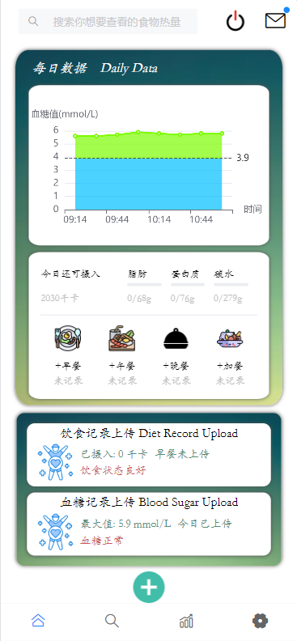

登录后首先进入首页。

**退出按钮：**

**消息查看按钮：**

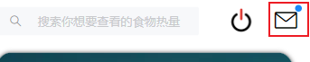

**当日血糖：**

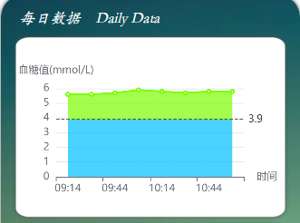

这里显示了今日血糖数据，3.9为低值警戒线，10为高值警戒线

**营养摄入量提醒：**

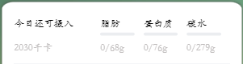

这里根据用户年龄、身高、体重等信息计算出了用户当日可摄入营养素的量，前一个数值为当日已摄入量，后一个数值为最大可摄入量。

**餐食记录：**

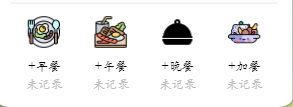

这里用户点击后可以记录饮食，每当一餐记录后“未记录”都会变更为“已记录”

**饮食上传总入口：**

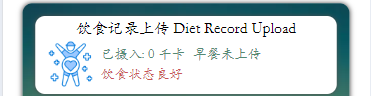

这个入口和上面餐食记录类似，但是是总入口，即进入后不指定当前记录的是早餐还是晚餐。这个地方显示了今日已摄入多少千卡的能量，以及哪一餐还未上传。当摄入量未超过最高值时显示“饮食状态良好”，否则会进行警告。

**血糖上传入口：**

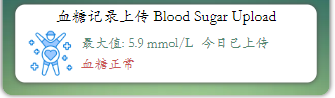

用户点击该入口可以上传血糖。这里显示了今日血糖最大值，以及今日是否有血糖记录。如果血糖值处在3.9-10的正常值区间范围内则会显示“血糖正常”，否则会给予警告

**“更多”按钮：**

这个按钮点击后可以显示更多其他隐藏入口

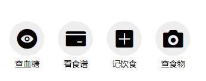

这是点击后显示的内容，点击“查血糖”将会进入血糖数据分析页面，点击“记饮食”将会进入饮食记录界面，点击“看食谱”将会进入食谱查询界面，点击“查食物”将会进入食物营养专家AI聊天页面。

## 记录饮食

### 手动记录

用户可以从首页餐食记录四个入口中的任意一个，或饮食记录总入口进入该功能页面

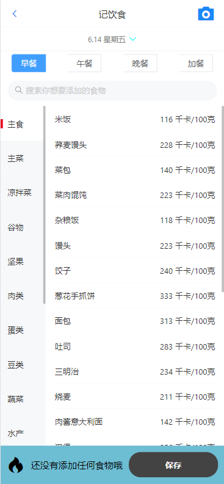

在这个页面，用户首先选择上传日期，以及要上传的是早餐、午餐、晚餐还是加餐。

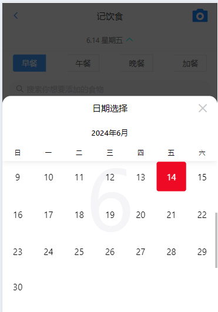

这里显示了食物数据库的内容，这里包括287种食物，并进行了分类。用户还可以在搜索框中搜索相关食物。注意搜索只会在当前食物类别中进行，即搜索结果是当前所选食物类别中的结果。

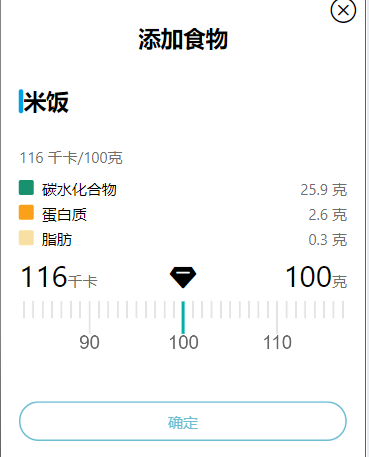

用户点击某一种食物后可以查看该食物单位质量营养素含量，并拖动横向滚动条选择摄入的食物质量。点击确定后将会暂存进摄入食物表单

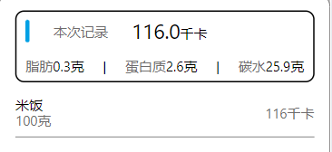

### 自动记录

用户还可以食物营养自动估计功能。

点击食物记录页面的相机按钮：

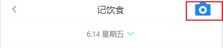

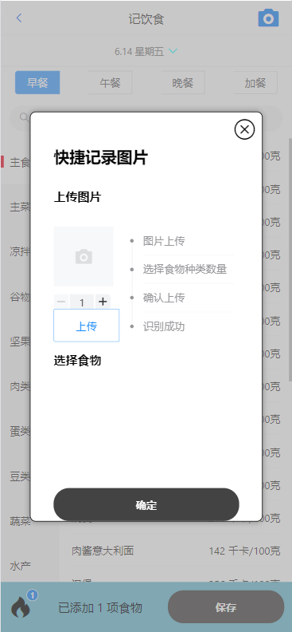

这里显示了自动营养估计页面。用户首先点击图像上传框上传图片

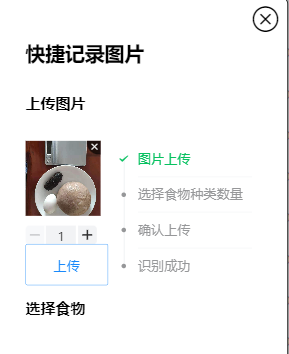

随后选择图片中的食物数量：

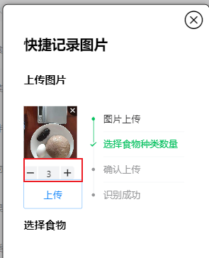

随后点击上传按钮：

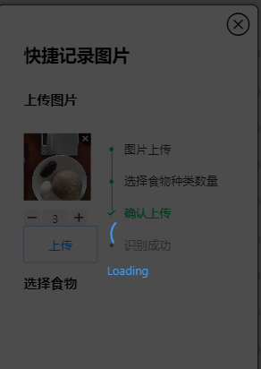

待后台算法分析完成后用户将会看到食物分析结果：

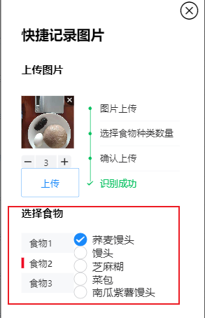

用户需要从返回的每种食物的五种可能结果中选择最符合实际的一项，随后点击确定

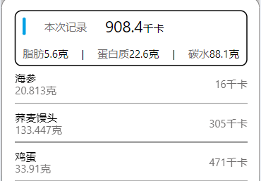

可以看到自动识别结果也暂存进了表单

### 结果保存

将手动或自动食物记录结果暂存进表单后点击“保存”即可保存到数据库。当然也可以选择“清空列表”以重新选择

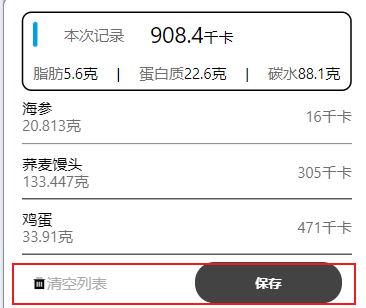

## AI咨询专家

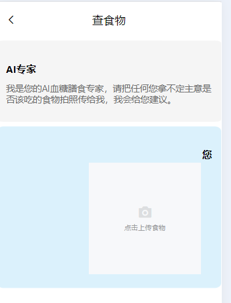

用户可以从首页点击加号后点击“查食物”按钮，进入AI咨询专家页面。用户可以上传食物图片，之后可以得到AI专家的饮食建议。

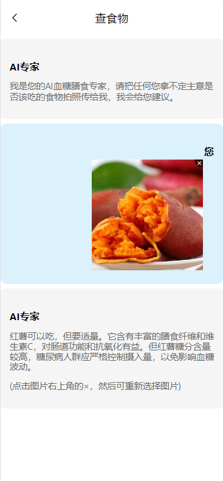

## 记录血糖

用户在首页点击“血糖记录上传”

可以选择文件上传和手动输入两种方式。

手动输入需要用户输入血糖值和对应的记录时间，点击“确认上传”

如果是文件上传则要选择文件后点击确认上传。注意文件的第一列必须是时间，第二列是以mmol/L为单位的血糖值

## 查看食谱

点击首页底部栏的放大镜按钮

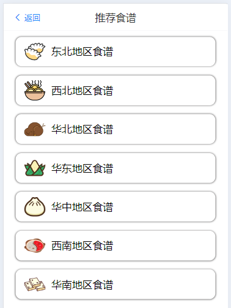

这里将《成人糖尿病食养指南》做了可视化，划分为七大地区。

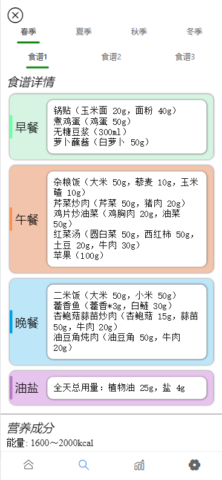

用户点击一个地区后可以看到四个季节的推荐食谱，每个季节有三个推荐食谱。

## 查看数据分析

### 饮食数据

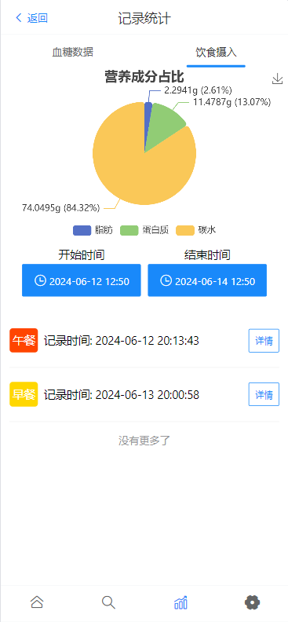

饮食数据可以显示所选时间段内各种营养素的摄入含量及占比

同时可以查看每一餐的详细记录。点击某一餐的“详情”可以查看这一餐吃了哪些食物，以及每种食物每种营养素的含量

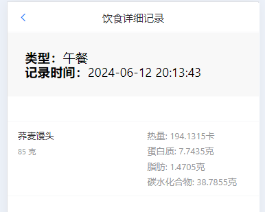

### 血糖数据

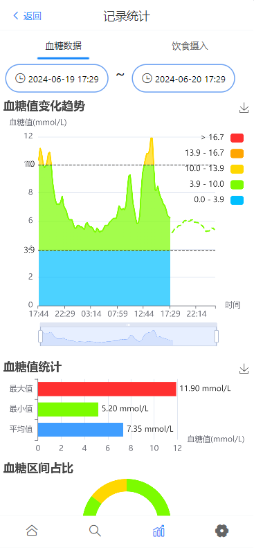

默认进入血糖分析页面时是显示当天血糖数据，并展示了未来血糖预测值。

该页面还统计了这一天血糖数据的最大、最小、平均值，以及血糖正常范围时间占比（TIR）

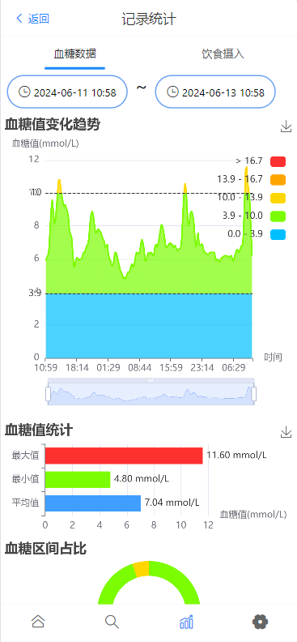

我们也可以查看血糖的历史数据，时间跨度最大为24h

## 查看通知

在首页点击信封样式图标可以进入通知和私信功能页面

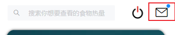

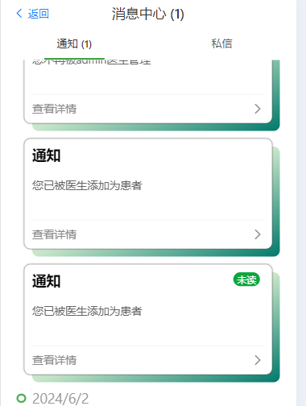

在通知页面，未读消息会显示“未读”，点击这条消息并点击“确定”后此条消息将被确认，“未读”标识则消失

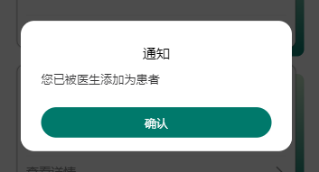

## 聊天

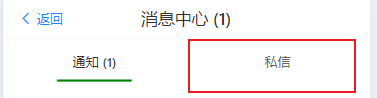

用户在消息中心点击私信可以进入与关联医生的聊天界面。

## 个人信息修改

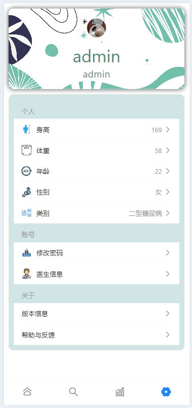

在这个页面患者可以修改自己的个人信息。

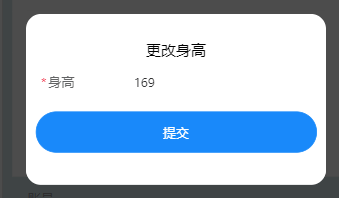

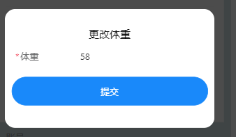

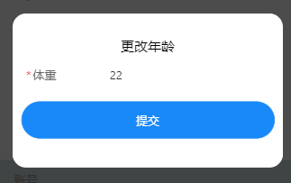

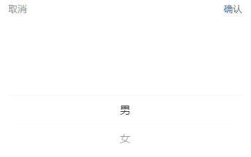

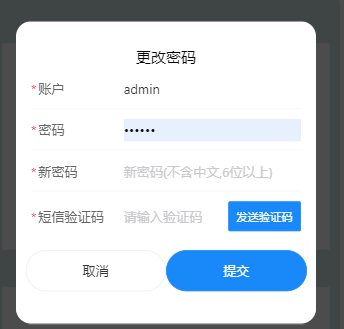

注意更新密码时需要向绑定手机发送验证码验证

## 查看医生信息

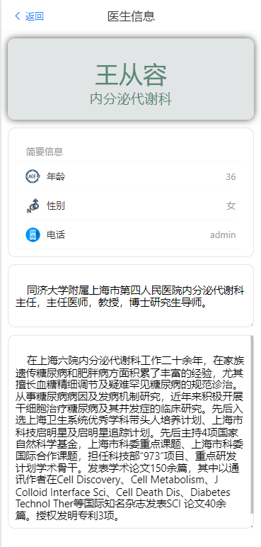

在医生信息页面可以看到与自己绑定的主治医生信息。

# 医生端

## 登录

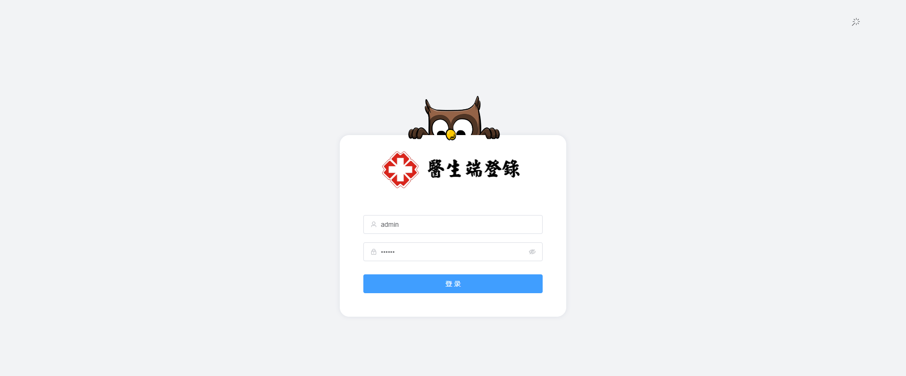

医生从这里输入账号密码登录

## 患者管理

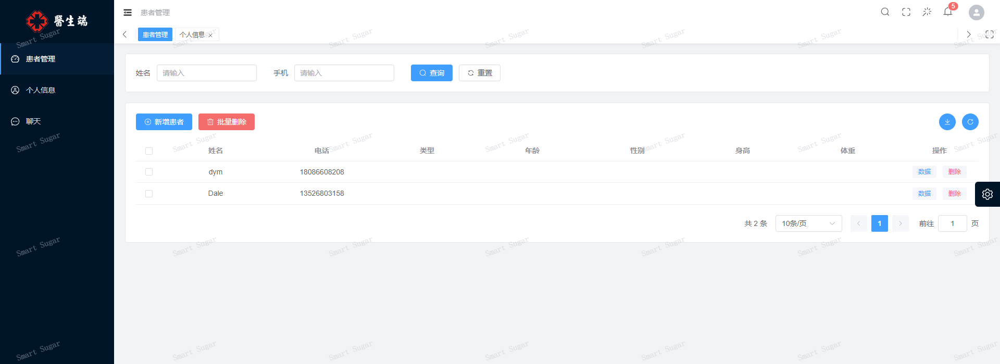

医生可以点击侧边栏的“患者管理”进入该功能。

这里显示了该医生所管理的所有患者。

当患者数量较多时，医生可以在这里通过姓名或手机号查询所管理的患者

这里医生可以添加或删除所管理的患者

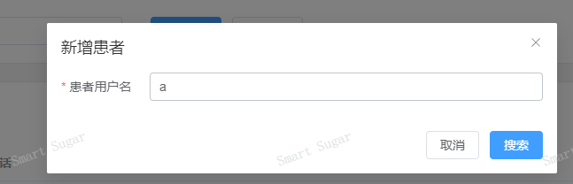

在这里医生可以搜索患者

医生可以将搜索到的患者添加到自己所管理的患者列表下。注意，已经被其他医生添加的患者无法被重复添加。如果需要请联系当前绑定的医生解绑。

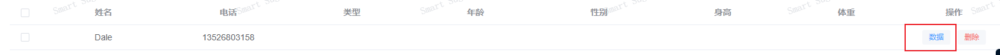

点击某个患者的“数据”按钮可以查看该患者饮食和血糖数据详情

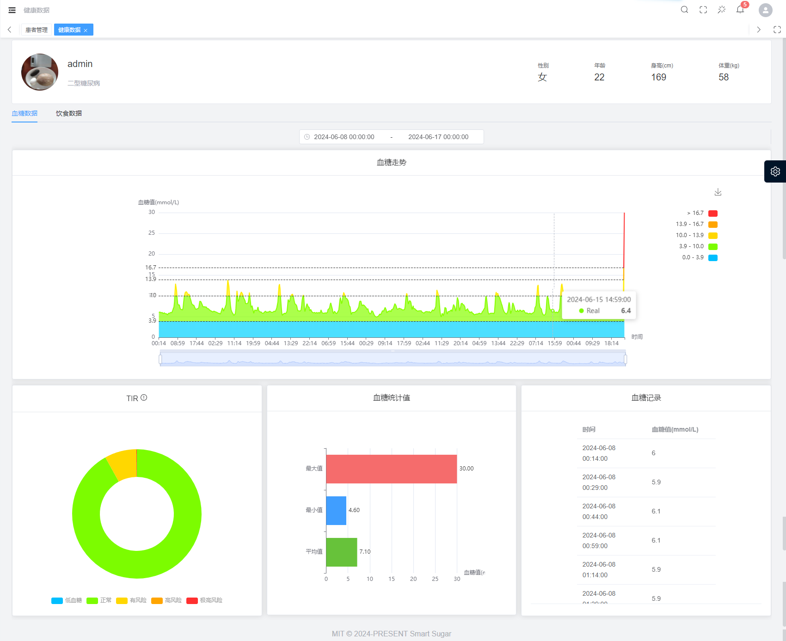

这里显示了患者个人信息（性别、年龄、身高、体重）、一周的血糖变化情况（折线图）、TIR、血糖极值以及血糖具体数据情况。

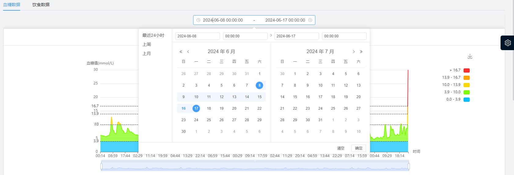

医生可以查看该患者其他时间段的血糖情况

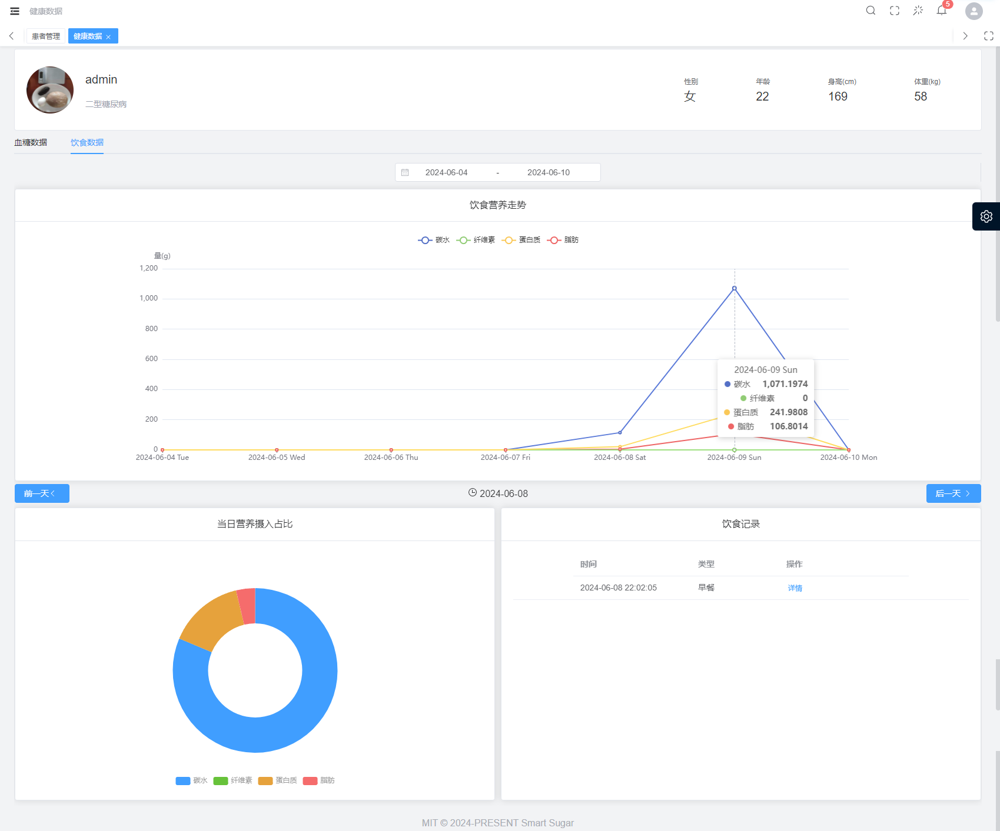

在饮食数据里，医生可以查看患者饮食摄入情况。上方展示一周内每天的营养素摄入情况，下方为这一周内某一天的饮食摄入占比及每一餐的详细信息。可以点击前一天或后一天进行切换。

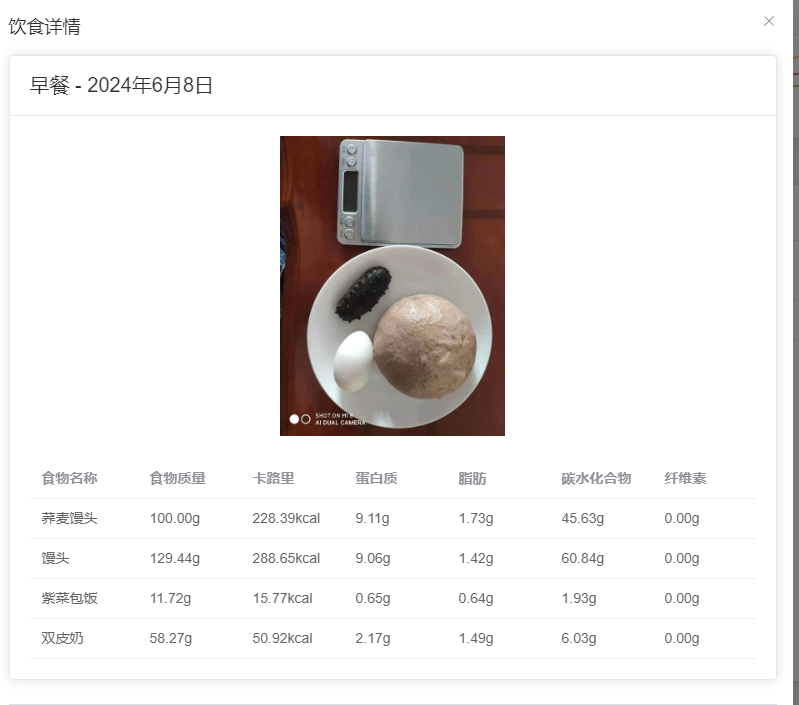

点击某一餐的详情可以看到这一餐中每种食物摄入的营养素含量。

## 个人信息

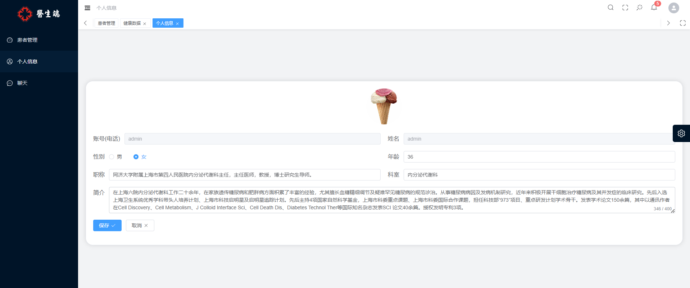

医生可以点击左侧“个人信息”按钮进入个人信息页面并进行修改。通过点击“保存”更新个人信息

## 聊天

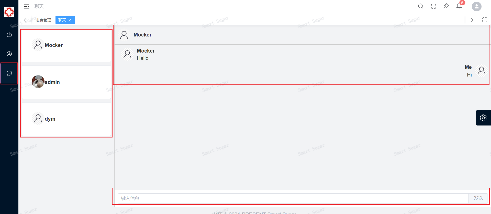

在聊天页面，医生可以选择所管理的患者进行聊天
