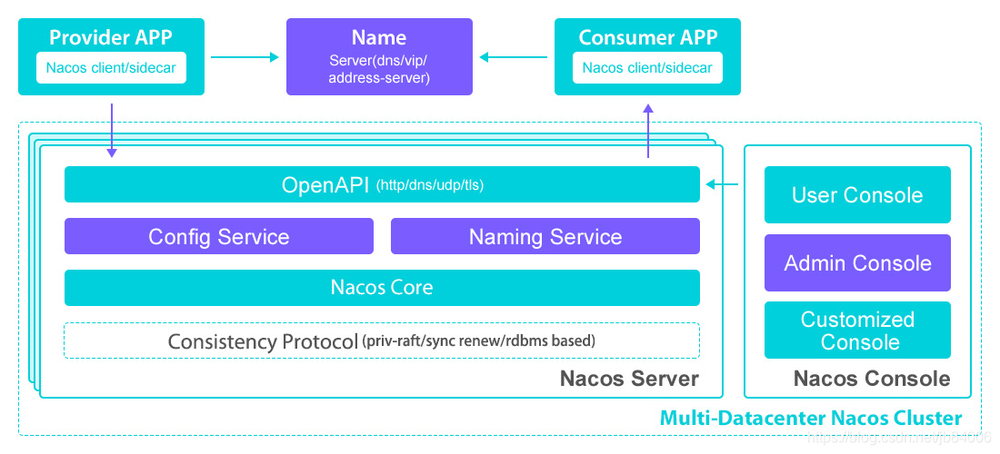
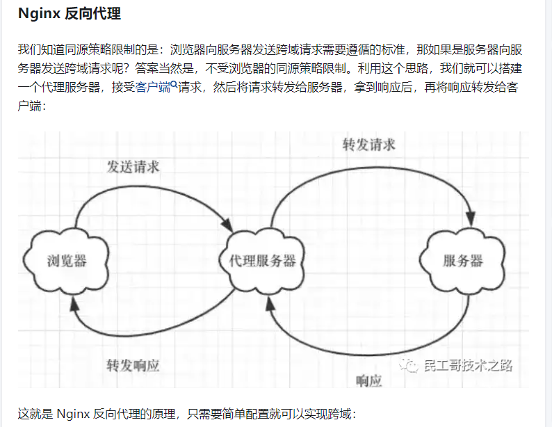

# sa-token

`StpUtil.login(id)`仅仅做了会话登录，但并没有主动向前端返回 token 信息。 是因为不需要吗？严格来讲是需要的，只不过 `StpUtil.login(id)` 方法利用了 Cookie 自动注入的特性，省略了你手写返回 token 的代码。

# nacos

https://blog.csdn.net/jb84006/article/details/117448534

1、nacos总体架构



2、nacos主要功能
2.1 注册中心（AP和CP）
  nacos最为核心功能：服务治理，随着微服务概念的流行，越来越多的系统被拆分成了多个服务，每个服务进行分布式部署，以往我们使用nginx对服务进行负载，客户端只需要调用nginx暴露出的地址即可，但是随着系统对可用性要求的提高，这种方式的弊端也随之暴露出来：假设某个服务集群部署了3台机器，由nginx将客户端请求进行负载转发到这3台机器中的某一台，如果某台机器上的服务挂掉了，nginx是无法感知到的，下一次请求还是有可能会转发到这台机器上，这时请求就会失败，这对于可用性要求较高的系统是无法接受的。而注册中心的出现就很好地解决了这个问题。
  通俗来说，注册中心就是用于服务提供者注册服务、服务调用者从中拉取服务列表然后采用负载均衡策略（如Ribbon）从列表中选出一个服务，从而完成请求调用。市面上可以用来作为注册中心的开源框架也比较多，如：Eureka、Zookeeper、Consul、nacos，本文主要介绍nacos，nacos的功能非常强大，也比较容易使用，支持AP和CP模型（相对于Eureka只支持AP模型、Zookeeper只支持CP模型、Consul只支持CP来说是一个优势），而且nacos性能也非常出色，未来注册中心大概率将是nacos的天下，因为Eureka从2.X版本开始已经闭源了，并且Eureka服务注册时延比nacos大得多，而Zookeeper是CP架构，虽然极大可能保证了数据的强一致性，但是很大程度上牺牲了可用性，对于注册中心来说，绝大部分场景下对可用性的需求要大于一致性（即使集群节点间数据暂时不一致，其实并不影响本次请求的调用，因为还有负载策略重试其它机器，而且最终集群节点间数据最终也会一致，对于nacos来说不一致的时间最多也就短暂的几秒，完全可以接受），Consul没用过，这里不做评论，所以未来nacos大概率会替代其它注册中心框架成为主流。

（1） 服务注册与发现
  服务注册与发现显然是注册中心的核心了，这里首先明确几个概念：
  nacos-server： 用于接收nacos-client端的服务注册请求并保存到注册表；
  nacos-client： 用于将服务注册到nacos-server，如用户下单操作，用户服务调用订单服务，此时订单服务就是服务提供者，服务提供者需要注册到注册中心，那么它就是nacos-client；
  服务调用者： 用户服务就是服务调用者。

（1.1）服务注册工作流程
  nacos-client（如订单服务）启动时，就会去注册中心进行服务注册，其实就是通过HTTP请求调用nacos-server，当nacos-server端接收到客户端的注册请求时，会将客户端的实例数据（包括ip、端口、微服务名等）保存到server端的注册表中（内存），如果订单服务是集群部署，那么同一个微服务名就会有多个实例数据形成一个实例列表。

（1.2）服务发现工作流程
  当用户服务调用订单服务时，首先会去nacos-server端获取注册表中的实例列表并存放在用户服务的本地内存中，再根据负载策略从实例列表中选出一个实例进行调用。

（2）客户端心跳机制
  nacos-client进行服务注册时（具体时机是调用nacos-server注册接口之前），会开启心跳任务，默认每5秒（可通过元数据参数preserved.heart.beat.interval进行设置）向nacos-server发送心跳，告诉服务端我还活着，不要将我剔除。

（3）服务端健康检查
  nacos-server接收到client端的服务注册请求后，将注册的实例数据写到注册表之前，会首先开启一个健康检查的定时任务（首次启动会延迟5秒执行，之后每5秒执行一次），其实主要就是处理nacos-client的心跳信息的，如果客户端实例超过15秒还没有发送心跳过来，则将实例健康状态改成false；如果客户端实例超过30秒还没有发送心跳过来，则剔除该实例。

（4）集群数据一致性管理
  如果nacos-server是集群部署，那么还需要考虑集群节点之间的数据一致性的问题，如何保证集群数据一致？集群挂了部分节点如何应对？节点恢复了如何保证数据跟其它节点一致？等等。nacos也有一系列的处理策略：
（4.1）客户端实例注册信息同步到nacos-server集群其它节点
nacos-server完成服务注册后，会开启一个定时任务，定时将自己注册表数据广播给集群其它节点，完成同步，相关代码：DistroProtocol.sync(…)。

（4.2）集群节点状态同步任务
  集群节点之间相互同步节点状态，如果有节点宕机了，集群其它节点会感知到并更新集群节点的状态，这个会影响权威节点的计算，相关代码：ServerStatusReporter。

（4.3）注册服务实例信息在机器节点间的同步任务
  nacos-server服务启动时，会开启该任务，这里需要说一个概念：权威节点，对于集群部署，服务注册时只会注册到其中一个集群节点，然后该节点数据会同步到其它节点，同步数据时，会根据注册实例的服务名进行hash计算并对集群节点数量取模，计算方式如：istroHash(serviceName) % servers.size()，根据得到的下标获取对应的集群节点，实际上是由该节点进行数据广播给其它节点，该节点就叫做权威节点，因此每个实例只会由固定一个权威节点负责同步给其它集群节点。每个实例数据不用所有server节点都去同步一遍，没有那个必要，这样做的好处是节省资源，提高了性能，同时也避免了多个节点数据如果某时刻不一致的话，都去同步这个实例可能会造成最新的数据被老的覆盖，相关代码：ServiceReporter类。

（4.4）集群数据拉取
  nacos-server服务启动时，会开启该任务，该任务是一个线程，递归执行，会以轮询的方式去其它集群节点的本地快照中（就是注册表的一个缓存，数据同注册表）拉取实例数据（拉到了就返回，所以实际上只会到其中个集群节点去拉取，没有必须去所有节点都拉取一遍，这样也是为了节约资源、提升性能），更新到自己的注册表和本地快照中。这个线程主要保障了一个场景：如果某个server节点挂了，那么它的数据跟其它节点肯定不一致了，下次重新启动的时候该线程就会从其它节点拉取保证数据的同步，相关代码：DistroProtocol.startLoadTask()。

（4.5）集群数据对账
  nacos-server服务启动时，会开启该定时任务，5秒一次，数据对账是4.4的补偿措施，作为兜底，定时将本节点数据广播给其它节点，处理流程跟4.4类似，相关代码：DistroProtocol.startVerifyTask()。

（5）客户端与服务端交互
（5.1）客户端定时拉取服务端注册实例数据
  客户端会有一个定时任务，定时去拉取服务端的实例列表数据并更新到客户端本地内存中，相关实现代码：HostReactor类；

（5.2）服务端推送
  服务端注册数据发生了变更，会通过udp推送到客户端，如果客户端需要实时监听到服务端注册数据的变化，就需要客户端开通udp端口，相关实现代码：PushService类；

2.2 配置中心
  配置中心相对更好理解一些，即可以将项目中的配置放到nacos配置中心中，这样配置与项目即可实现解耦。

2.3 OpenAPI
  nacos也对外也提供了关于服务注册与发现、配置管理、命名空间相关操作的OpenAPI，参考官网：https://nacos.io/zh-cn/docs/open-api.html，主要用于支持异构项目，虽然目前nacos客户端主要是以Java语言开发的项目为主，而且官方当前也仅提供了Java版本的客户端（不过nacos开源社区已经有了多种语言的SDK），但是nacos立意深远，目标远不止于此，将来官方很可能还会提供其它语言版本的客户端，但是目前异构版本需要用户自己与nacos进行整合，因此nacos对外提供了这些OpenAPI供用户使用。

# nginx反向代理解决跨域



# 解决报错

## Gateway和SpringMvc依赖冲突问题和解决

由于使用common中的redis服务，因此gateway添加common模块依赖，这样就导致了web和webflux冲突

网关依赖

<!-- Spring Gateway 网关依赖 -->
<dependency>
    <groupId>org.springframework.cloud</groupId>
    <artifactId>spring-cloud-starter-gateway</artifactId>
</dependency>
SpringMvc的依赖

<dependency>
    <groupId>org.springframework.boot</groupId>
    <artifactId>spring-boot-starter-web</artifactId>
</dependency>
这两个依赖在同一个项目中时,默认情况下启动会报错

SpringMvc框架中自带一个Tomcat服务器

而SpringGateway框架中自带一个Netty的服务器

在启动项目时,两个框架中包含的服务器都想占用相同端口,因为争夺端口号和主动权而发生冲突

导致启动服务时报错

要想能够正常启动必须在yml文件配置

spring:
  main:
    web-application-type: reactive

添加这个配置之后,会Tomcat服务器会变成非阻塞的运行

但注意，这种方法必须保证引入的依赖中无其他依赖spring-boot-starter-web的服务，不然又会连环报错


实际解决方案是：

将constrants、enum等全局需要的部分抽离出来再建一个文件夹，不要写在common里

## 找不到服务的错误

```
Consider defining a bean of type 'com.tongji.doctor.service.IRecordService' in your configuration.
```

检查serviceImpl类上是否加了@service注解，没加的要加上

## 注解

get方法参数不能加@RequestBody

## openAPI文档中测试get无法传递参数

目前的方法是只能在url栏像下面这样写

```
/glucose/getGlucose?id=1&startTime=2024-05-15T00:00:00&endTime=2024-05-15T23:59:59
```


# 测试注意

直接运行后端代码，在openAPI文档中测试将会绕开网关，使角色鉴权失效

因此所有调用需要往gateway发，不能直接调服务端


netstat -aon|findstr "端口号"

taskkill -pid 查出来的进程号 -f