# 系统设计概述

通过多轮需求分析细化和迭代，我们最终确定了登陆注册、食物查询、食谱查询、饮食记录、数据分析五个功能作为此次软件工程实战开发的目标。这五个功能在类上可以划分到饮食、血糖、用户三个部分。

系统总体采用BS架构，并结合了微服务架构，使用nacos、榛子云、minio、redis等多项服务，保证系统的可用性、稳定性、安全性。

设计文档将从体系结构、细化类图模型、数据库设计、构件设计、接口设计、算法流程、页面设计、导航设计等部分进行展开介绍，详细阐述系统设计细节。

# 体系结构设计

## 高层概述

### 系统部署图

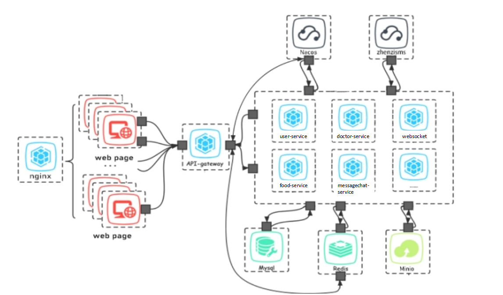 

### BS系统架构说明

1. 前端技术栈

前端使用vue技术开发，其中使用vuex进行状态管理，使用vue-router来通过路由对组件进行管理。将构建好的项目通过nginx进行部署，使用nginx可以通过负载均衡配置来提高网页的高并发承载能力。

2. 后端技术栈

在后端使用微服务架构进行开发，具体使用到为SpringCloud技术来构建微服务项目。使用微服务将不同的业务进行拆分解耦，便于业务横向和纵向拓展，实现敏捷开发和部署。

## 架构组件

### 系统架构图

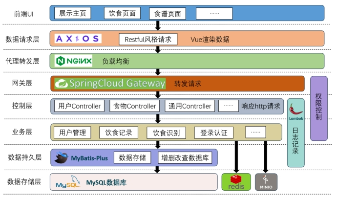 

### 系统架构说明

1. Nacos

Nacos是一个专门设计用于构建云原生应用的动态服务发现、配置管理和服务管理平台。它的主要功能是帮助我们更轻松地发现、配置和管理微服务。

使用Nacos，我们可以更加敏捷和容易地构建、交付和管理微服务平台。首先，Nacos提供了一个强大的服务发现功能。它可以自动检测和注册新启动的服务，同时提供实时的服务状态信息。这使得我们可以轻松地找到并调用其他服务的API，而无需手动配置和管理服务地址。

其次，Nacos还提供了灵活的配置管理功能。通过Nacos的配置中心，我们可以集中管理所有微服务的配置信息。无论是数据库连接字符串、API密钥还是其他敏感信息，都可以通过Nacos进行统一管理和动态更新。这样，当需要更改配置时，只需在Nacos上进行修改，而无需逐个修改每个服务的配置文件。

此外，Nacos还提供了一套完善的服务管理工具。我们可以在Nacos的控制台上查看和管理所有的微服务实例。他们可以监控服务的运行状态、日志输出以及性能指标，从而及时发现和解决问题。同时，Nacos还支持对服务进行分组和标签管理，使得我们可以更方便地组织和管理自己的微服务。

总的来说，我们使用Nacos是由于它是一个功能强大且易于使用的动态服务发现、配置管理和服务管理平台。它的网页控制台明确易操作，以及统一的配置中心可以对服务实现动态配置，这些都是选择它的重要原因之一。无论是构建新的云原生应用，还是迁移现有的应用程序到云环境，Nacos都是一个值得考虑的选择。

2. Mysql

在我们的项目中，数据的存储和管理是一个非常重要的环节。这些数据不仅需要在项目运行期间被有效地处理和使用，而且在项目结束后，也需要被持久化存储到磁盘上，以便于未来的查阅和使用。这就需要我们使用到数据库技术。

数据库是一种用于存储、管理和检索大量数据的系统。它可以帮助我们将数据组织成易于理解和操作的形式，从而提高数据处理的效率和准确性。在选择数据库时，我们需要考虑多种因素，包括数据库的性能、稳定性、可用性、易用性和成本等。

在众多的数据库中，我们选择了Mysql数据库。这个决定是基于多方面的考虑的。Mysql数据库是一种轻量级的数据库。与Oracle数据库相比，Mysql数据库的规模较小，安装和配置也相对简单。这使得Mysql数据库在我们的项目中更容易被部署和使用。

其次，Mysql数据库的维护工作相对较少。Oracle数据库由于其庞大的规模和复杂的结构，尤其是部署复杂，需要投入大量的时间和精力进行维护。而Mysql数据库则不需要这么多的维护工作，我们可以快速便捷得部署到云端，这可以让我们更专注于项目的开发和优化。

最后，Mysql数据库在市场上的占有率也是我们选择它的一个重要原因。据统计，Mysql数据库在全球的市场占有率非常高，这充分证明了其可用性、高效性和稳定性。这也意味着，如果我们在使用过程中遇到问题，我们可以很容易地找到相关的解决方案和资源。

基于上述的原因，我们选择了Mysql数据库作为我们的项目的数据存储方案。我们相信，Mysql数据库将能够为我们的项目提供稳定、高效、灵活的服务。

3. Redis

在提供服务的过程中，由于我们采用了微服务架构，因此如何实现单点登录和统一鉴权成为了一个必须要解决的问题。

Redis是一款开源的基于内存的键值对存储系统，它具备极高的性能。由于Redis是基于内存的，它可以快速地读取和写入数据。我们可以将多个不同的微服务应用都调用同一个Redis服务，并将登录信息存储到这个Redis中，从而实现单点登录的效果。

同时，Redis的数据存储特性也能够帮助应用实现一些特定的效果，比如验证码的时效性。通过将验证码存储在Redis中，并设置相应的过期时间，我们可以确保验证码在一定时间内有效。当用户输入验证码时，系统可以检查Redis中是否存在该验证码以及是否已过期，从而判断验证码的有效性。

我们利用Redis作为统一的登录信息存储和验证码管理工具，它帮助我们在微服务架构中实现单点登录和统一鉴权，并且能够提供验证码的时效性功能。

4. 榛子云

在我们的应用程序中，当用户进行注册时，他们需要使用他们的手机号码来接收验证码，以便能够成功登录。这个过程涉及到发送短信验证码，而这个功能的效果需要通过调用外部服务来实现。然而，我们注意到，像阿里云这样的平台规定，如果要使用他们的短信验证码服务，必须拥有企业资质。由于我们目前只能使用到测试性质的短信服务，因此我们选择了榛子云的短信验证码服务作为我们的合作伙伴。

在使用中我们只需要调用榛子云的短信接口，就可以实现发送短信的功能。

5. Minio

在业务中，我们经常会遇到一些大文件，比如图片、文档等。这些大文件如果直接存储在数据库中，不仅会占用大量的数据库空间，还可能导致数据库的性能下降。因此，我们需要将这些大文件存储到其他地方。

Minio是一个开源的对象存储服务，它可以帮助我们解决这个问题。我们可以将大文件通过Minio提供的接口存储到其服务器上，而不需要将这些大文件直接存储在数据库中。这样，数据库只需要存储这些大文件的访问地址即可。

在部署Minio时，我们选择使用docker容器化技术。docker是一种轻量级的虚拟化技术，它可以将应用程序及其依赖环境打包成一个独立的容器，然后在任何支持docker的环境中运行这个容器。使用docker容器化技术来部署Minio，可以极大地降低部署的难度和复杂性。

当我们将Minio部署到云端后，就可以通过调用Minio提供的接口来使用其服务了。无论是在本地还是远程，只要能够访问到Minio的服务器，就可以方便地获取和使用存储在其中的大文件。

6. 网关

在微服务架构中，每个服务都是独立的，它们不会单独向外提供服务。客户端需要通过一个确定的端口来发送请求，这时网关就起到了重要的作用。网关会对客户端发出的请求进行处理，并将其转发给相应的服务。同时，使用网关还可以提供最基础的保护措施，保护下一层的应用安全，抵御各种攻击，比如实现统一的鉴权。

为了保护具体的业务微服务的稳定性，我们在这些微服务前面添加了这一层的网关。网关的作用不仅仅是转发请求，更重要的是它能够对请求进行一些预处理和过滤，确保只有合法的请求才能到达后面的程序。这样可以避免恶意请求对系统造成破坏，提高系统的安全性和稳定性。

通过使用网关，我们用到了以下功能：

- 请求转发：将客户端的请求转发给相应的微服务，实现请求的路由和分发。
- 鉴权验证：对客户端的请求进行鉴权验证，确保只有经过授权的请求才能访问系统资源。
- 负载均衡：根据系统的负载情况，将请求均匀地分配给不同的微服务实例，提高系统的并发处理能力。
- 安全防护：对请求进行过滤和拦截，防止恶意攻击和非法访问。

7. 业务微服务

在这个环境中，业务微服务扮演着至关重要的角色。它们负责实现具体的业务逻辑，以满足客户端的各种需求。这些业务逻辑可能涉及到复杂的数据处理、计算和分析。

对于客户端的需求，业务微服务能够准确相应理解。在实现业务逻辑的过程中，业务微服务需要进行大量的信息处理。这包括收集、存储、分析和使用数据。通过这种方式，业务微服务能够确保其提供的解决方案能够满足客户端的需求。

此外，业务微服务还需要与其他系统进行数据交互。这可能包括从其他系统获取数据，或者将数据发送到其他系统。通过这种方式，业务微服务能够确保其提供的解决方案是完整的，并且能够满足客户端的所有需求。我们在使用中主要用到的是对于登录用户的同步上，在不同微服务中能够识别到同一个登录用户，使用它的信息。

# 系统模型

## 系统类图及说明

在设计模型中我们对每个类的属性及操作进行了细化，确定了操作所使用的数据结构及类型，确定了方法返回内容及返回类型，对于多参数调用，进行了查询参数的封装。

### 血糖模块

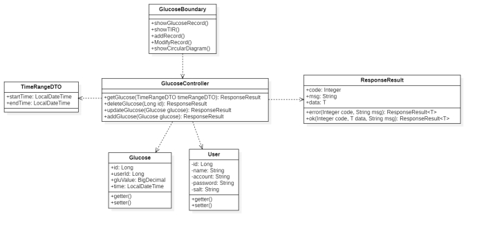 

血糖模块边界类为GlucoseBoundary，负责血糖数据、血糖目标范围时间TIR、血糖数据统计图的展示，以及血糖数据记录的输入工作；控制类从前端获取用户所输入的输入，或接受用户执行的动作，与持久化层进行交互进行数据的处理与传输。其中TimeRangeDTO是一个用于时间范围的数据传输封装类。Glucose和User是两个实体类，分别用于血糖数据和用户数据的记录。用户通过与User表的交互，可以限制当前用户只操作属于自己的数据，而不会对其他用户数据造成混杂或影响。ResponseResult为返回内容的封装类，便于统一返回内容格式。

### 饮食模块

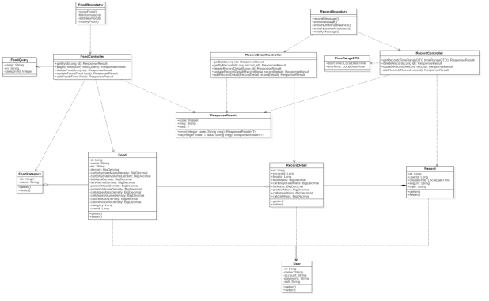 

饮食模块中主要包括食物和饮食记录两个部分。

食物子模块的边界类为FoodBoundary，主要负责前端食物库数据的展示；控制类为FoodController，负责食物按名称、类别的分页查询工作。饮食记录子模块的边界类为RecordBoundary，负责饮食记录的显示、添加工作；控制类为REcordController和RecordDetailController，负责饮食记录，及一条饮食记录所对应的多条具体饮食记录的显示、添加工作。ResponseResult为返回内容的封装类，便于统一返回内容格式。

该模块涉及到五个实体类：食物类别FoodCatecory、食物表Food、用户表User、饮食记录表Record、饮食详情表RecordDetail。通过FoodCatecory和Food表，我们可以做到食物的分类查询，便于用户更清晰的查看和使用食物数据库的内容；通过User、Record、RecordDetail三个表，用户可以查看自己过往饮食记录及每一餐的详细饮食数据，并做到不同用户数据别的隔离，增加用户数据的安全性。

### 用户模块

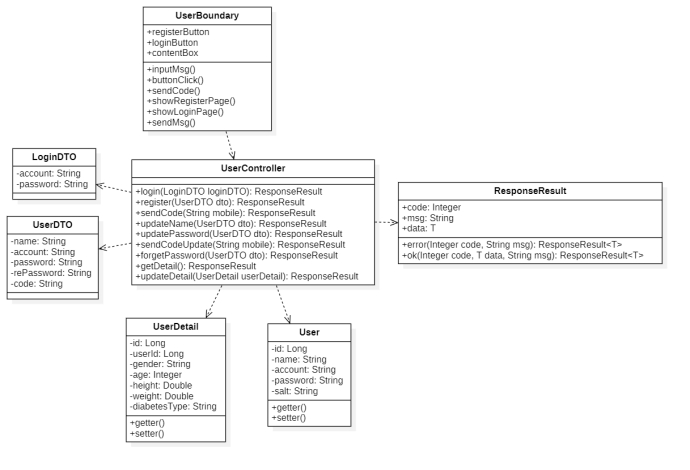 

用户模块的边界类为UserBoundary，负责用户注册及登录时的数据输入、用户注册和登陆动作等功能，控制类为UserController，负责处理用户登录、注册、获取用户个人数据等功能的具体处理逻辑。在这里还用到了两个数据封装类：LoginDTO和UserDTO，用于以封装类的形式实现边界类、控制类和实体类之间的数据传输。该模块涉及UserDetail和User两个表，这两个表中记录了用户的账户数据及健康数据。

# 数据库设计

## 数据库设计图

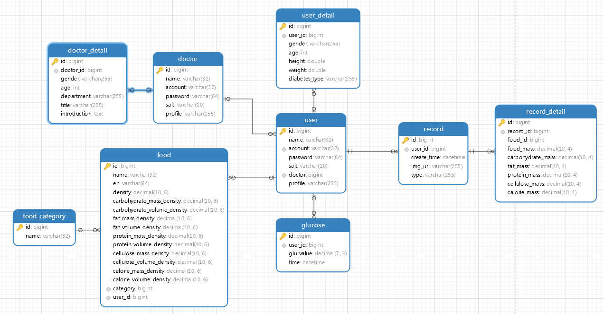 

## 表的设计详述

### 用户表

| 字段名   | 数据类型 | 长度 | 说明                     | 备注 |
| -------- | -------- | ---- | ------------------------ | ---- |
| ID       | BIGINT   | 20   | 用户id                   | 主码 |
| NAME     | VARCHAR  | 32   | 用户姓名                 |      |
| ACCOUNT  | VARCHAR  | 32   | 用户账户                 |      |
| PASSWORD | VARCHAR  | 64   | 用户密码                 |      |
| SALT     | VARCHAR  | 10   | 加密盐，用于加密用户密码 |      |
| PROFILE  | VARCHAR  | 255  | 头像地址                 |      |

### 用户详情

| 字段名        | 数据类型 | 长度 | 说明       | 备注                               |
| ------------- | -------- | ---- | ---------- | ---------------------------------- |
| ID            | BIGINT   | 20   | 详情ID     | 主码                               |
| USER_ID       | BIGINT   | 20   | 用户ID     | 外码                               |
| GENDER        | VARCHAR  | 255  | 性别       |                                    |
| AGE           | INT      | 11   | 年龄       |                                    |
| HEIGHT        | DOUBLE   |      | 身高       |                                    |
| WEIGHT        | DOUBLE   |      | 体重       |                                    |
| DIABETES_TYPE | VARCHAR  | 255  | 糖尿病类型 | Ⅰ型糖尿病、Ⅱ型糖尿病、妊娠期糖尿病 |

### 血糖表

| 字段名    | 数据类型     | 长度 | 说明     | 备注 |
| --------- | ------------ | ---- | -------- | ---- |
| ID        | BIGINT       | 20   | 血糖ID   | 主码 |
| USER_ID   | BIGINT       | 20   | 用户ID   | 外码 |
| GLU_VALUE | DECIMAL(7,3) | 10   | 血糖值   |      |
| TIME      | DATETIME     |      | 记录时间 |      |

### 食物表

| 字段名                      | 数据类型      | 长度 | 说明                       | 备注 |
| --------------------------- | ------------- | ---- | -------------------------- | ---- |
| ID                          | BIGINT        | 20   | 食物ID                     | 主码 |
| NAME                        | VARCHAR       | 32   | 中文名称                   |      |
| EN                          | VARCHAR       | 64   | 英文名称                   |      |
| DENSITY                     | DECIMAL(10,6) | 16   | 密度（g/ml）               |      |
| CARBOHYDRATE_MASS_DENSITY   | DECIMAL(10,6) | 16   | 碳水化合物质量密度（g/g）  |      |
| CARBOHYDRATE_VOLUME_DENSITY | DECIMAL(10,6) | 16   | 碳水化合物体积密度（g/ml） |      |
| FAT_MASS_DENSITY            | DECIMAL(10,6) | 16   | 脂肪质量密度（g/g）        |      |
| FAT_VOLUME_DENSITY          | DECIMAL(10,6) | 16   | 脂肪体积密度（g/ml）       |      |
| PROTEIN_MASS_DENSITY        | DECIMAL(10,6) | 16   | 蛋白质质量密度（g/g）      |      |
| PROTEIN_VOLUME_DENSITY      | DECIMAL(10,6) | 16   | 蛋白质体积密度（g/ml）     |      |
| CELLULOSE_MASS_DENSITY      | DECIMAL(10,6) | 16   | 纤维素质量密度（g/g）      |      |
| CELLULOSE_VOLUME_DENSITY    | DECIMAL(10,6) | 16   | 纤维素体积密度（g/ml）     |      |
| CALORIE_MASS_DENSITY        | DECIMAL(10,6) | 16   | 热量质量密度（g/g）        |      |
| CALORIE_VOLUME_DENSITY      | DECIMAL(10,6) | 16   | 热量体积密度（g/ml）       |      |
| CATEGORY                    | BIGINT        | 20   | 类别ID                     | 外码 |
| USER_ID                     | BIGINT        | 20   | 用户ID                     | 外码 |

### 食物类别表

| 字段名 | 数据类型 | 长度 | 说明     | 备注 |
| ------ | -------- | ---- | -------- | ---- |
| ID     | BIGINT   | 20   | 类别ID   | 主码 |
| NAME   | VARCHAR  | 32   | 分类名称 |      |

### 记录表

| 字段名      | 数据类型 | 长度 | 说明     | 备注     |
| ----------- | -------- | ---- | -------- | -------- |
| ID          | BIGINT   | 20   | 类别ID   | 主码     |
| USER_ID     | BIGINT   | 20   | 用户ID   | 外码     |
| CREATE_TIME | DATETIME |      | 创建时间 |          |
| IMG_URL     | VARCHAR  | 255  | 图片路径 |          |
| TYPE        | VARCHAR  | 255  | 记录类型 | 早午晚餐 |

### 记录详情表

| 字段名            | 数据类型      | 长度 | 说明           | 备注 |
| ----------------- | ------------- | ---- | -------------- | ---- |
| ID                | BIGINT        | 20   | 类别ID         | 主码 |
| RECORD_TD         | BIGINT        | 20   | 记录ID         | 外码 |
| FOOD_ID           | BIGINT        | 20   | 食物ID         | 外码 |
| FOOD_MASS         | DECIMAL(10,4) | 14   | 食物质量       | (g)  |
| CARBOHYDRATE_MASS | DECIMAL(10,4) | 14   | 碳水化合物质量 | (g)  |
| FAT_MASS          | DECIMAL(10,4) | 14   | 脂肪质量       | (g)  |
| PROTEIN_MASS      | DECIMAL(10,4) | 14   | 蛋白质质量     | (g)  |
| CELLULOSE_MASS    | DECIMAL(10,4) | 14   | 纤维素质量     | (g)  |
| CALORIE_MASS      | DECIMAL(10,4) | 14   | 热量           | (g)  |

### 医生表

| 字段名   | 数据类型 | 长度 | 说明     | 备注 |
| -------- | -------- | ---- | -------- | ---- |
| ID       | BIGINT   | 20   | ID       | 主码 |
| NAME     | VARCHAR  | 20   | 昵称     |      |
| COUNT    | VARCHAR  | 20   | 账号     |      |
| PASSWORD | VARCHAR  | 14   | 密码     |      |
| SALT     | VARCHAR  | 10   | 盐       |      |
| PROFILE  | VARCHAR  | 255  | 头像地址 |      |

### 医生详情表

| 字段名       | 数据类型      | 长度 | 说明     | 备注 |
| ------------ | ------------- | ---- | -------- | ---- |
| ID           | BIGINT        | 20   | 类别ID   | 主码 |
| DOCTOR_TD    | BIGINT        | 20   | 记录ID   | 外码 |
| GENDER       | BIGINT        | 20   | 食物ID   |      |
| AGE          | DECIMAL(10,4) | 14   | 食物质量 |      |
| DEPARTMENT   | VARCHAR       | 255  | 部门     |      |
| TITLE        | VARCHAR       | 255  | 职称     |      |
| INTRODUCTION | TEXT          |      | 介绍     |      |

# 构件级设计\****

## ***\*5.1 构件图\****

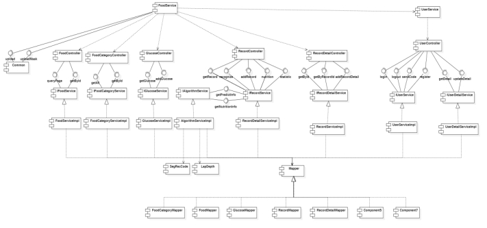 

## ***\*5.2 UserService中的构件\****

### ***\*5.2.1 UserController构件\****

这部分主要负责处理用户模块相关的业务逻辑和流程控制。通过接收来自前端或其他服务的请求，处理业务逻辑，并与问题域构件和基础设施构件进行交互，以完成特定的用户服务需求。

UserController（用户控制器）：

\1) 功能：处理用户注册、登录、获取用户信息、修改密码、修改用户细节信息、修改信息时发送验证码、获取用户细节信息等请求。

\2) 交互：接收前端发送的用户认证请求，协调与用户服务相关的业务逻辑，并将结果返回给前端。

\3) 主要方法：

a) register(userData): 处理用户注册请求，创建新用户并存储相关信息。

路径：POST /user/register。

b) login(loginData): 处理用户登录请求，验证用户凭据并返回访问令牌。

路径：POST /user/login。

c) logout(): 处理用户退出登录请求。

路径：POST /user/logout。

d) sendCode(mobile): 处理发送验证码请求。

路径：GET /user/sendCode。

e) getDetail(): 获取用户身体健康状况方面的信息。

路径：GET /user/getDetail。

f) updateDetail(userDetail): 更新用户个人信息。

路径：PUT /user/updateDetail。

### ***\*5.2.2 UserServiceImpl构件\****

该构件中实现了IUserService所定义的接口，实现登录、登出、发送验证码、新用户注册等逻辑。

UserServiceImpl（用户服务构件）：

\1) 功能：实现用户注册、登录、获取用户信息、修改密码、修改用户细节信息、修改信息时发送验证码、获取用户细节信息等的具体逻辑。

\2) 交互：接收控制器转发的前端动作或输入信息，根据输入信息和所调用的方法完成注册、登录等逻辑。

\3) 主要方法：

a) register(userData): 实现处理用户注册请求，创建新用户并存储相关信息的逻辑。

b) login(loginData): 实现处理用户登录请求，验证用户凭据并返回访问令牌的逻辑。

c) logout(): 实现处理用户退出登录请求的逻辑。

d) sendCode(mobile): 实现处理发送验证码请求的逻辑。

### ***\*5.2.3 UserDetailServiceImpl构件\****

该构件中实现了IUserDetailService中定义的接口。

\1. UserDetailServiceImpl（用户个人信息服务构件）

\2. 功能：实现获取、修改用户具体个人信息的逻辑。用于用户首次注册时补全个人信息，以及注册后查看个人信息的功能。

\3. 交互：接收控制器转发的前端动作或输入信息，根据输入信息和所调用的方法完成返回用户个人信息数据、更新数据库中信息等逻辑。

\1) getDetail(): 获取用户身体健康状况方面的信息。

\2) updateDetail(userDetail): 更新用户个人信息。

## ***\*5.3 FoodService中的构件\****

### ***\*5.3.1 FoodController构件\****

这部分构件是FoodService中处理食物领域业务逻辑和数据管理的核心部分。它包含食物类别、食物信息、饮食记录等相关功能。问题域构件定义了食物实体、食物操作的规则和逻辑，确保食物数据的完整性和安全性，并提供与食物相关的核心业务功能。

FoodController（食物管理器）：

\1. 功能：处理食物信息、分类、记录等业务逻辑。

\2. 交互：与前端及服务层FoodServiceImpl构件交互。

\1) getById(id): 获取食物信息。

路径：GET /food/getById。

\2) page(foodQuery): 分页查询食物信息

路径：GET /food/foodQuery。

### ***\*5.3.2 FoodCategoryController构件\****

该构件是食物类别信息的控制器，用于接收前端按食物类别进行查询的请求，并调用下层处理具体业务逻辑的方法。

FoodCategoryController（食物类别控制器）：

\1. 功能：处理食物分类查询等业务逻辑。

\2. 交互：与前端及服务层FoodCategoryServiceImpl构件交互。

\1) getAll(): 获取所有类别信息。

路径：GET /food-category/getAll。

\2) getById(id): 按id查询食物类别信息。

路径：GET /food-category/getById。

### ***\*5.3.3 GlucoseController构件\****

该构件为血糖模块的控制构件，负责处理血糖数据录入、查询、统计的相关工作

GlucoseController（血糖数据控制器）：

\1. 功能：处理血糖数据录入、查询、统计等业务逻辑。

\2. 交互：与前端及服务层GlucoseServiceImpl构件交互。

\3. 示例操作：

a) getGlucose(timeRangeDTO): 按时段获取血糖数据。

路径：GET /glucose/getGlucose。

b) addGlucose(glucoseAddDTO): 添加一条血糖数据。

路径：POST /glucose/addGlucose。

### ***\*5.3.4 RecordController构件\****

该构件为饮食记录的控制构件，负责处理饮食记录查询、添加、统计，及与算法的对接

RecordController（饮食记录控制器）：

\1. 功能：处理饮食记录录入、查询、统计等业务逻辑。

\2. 交互：与前端及服务层RecordServiceImpl构件交互。

\3. 示例操作：

a) getRecord(timeRangeDTO): 按时段获取饮食数据。

路径：GET /record/getRecord。

b) addRecord(RecordAddDTO): 添加一条饮食数据。

路径：POST /record/addRecord。

c) recognize(recognizeDTO): 进行上传图片的图像识别。

路径：GET /record/recognize。

d) nutrition(FoodChosenDTO): 对上传的图片进行营养评估。

路径：POST /record/nutrition。

e) statistic(timeRangeDTO): 汇总指定时间段的饮食数据。

路径：GET /record/statistic。

### ***\*5.3.5 RecordDetailController构件\****

该构件为饮食记录详细信息的控制构件，由于一条饮食数据对应多个详细食物信息，因此要设计详细信息组件来进行处理。

RecordDetailController（饮食记录控制器）：

\1. 功能：处理饮食记录录入、查询、统计等业务逻辑。

\2. 交互：与前端及服务层RecordDetailServiceImpl构件交互。

\3. 示例操作：

a) getById(id): 通过id获取饮食详细数据。

路径：GET /record-detail/getById。

b) getByRecordId(record_id): 通过record_id获取饮食详细数据列表。

路径：GET /record-detail/getByRecordId。

c) addRecordDetail(recordDetailAddDTO): 添加一条饮食详细数据。

路径：POST /record-detail/addRecordDetail。

### ***\*5.3.6 FoodServiceImpl构件\****

该构件实现了IFoodService中定义的接口，提供按id、按类别进行食物查询的功能，支持通过模糊匹配按食物名称查找。

FoodServiceImpl：

\1. 功能：实现处理食物信息查询的具体业务逻辑。

\2. 交互：与食物数据实体交互，管理食物信息等。

\3. 示例操作：

a) getById(id): 获取食物信息。

b) page(foodQuery): 分页查询食物信息。

### ***\*5.3.7 FoodCategoryServiceImpl构件\****

该构件实现了IFoodCategoryService中定义的接口，支持按id获取食物类别信息，以及获取所有类别种类。

FoodCategoryServiceImpl：

\1. 功能：处理食物分类查询等业务逻辑。

\2. 交互：与食物类别数据实体交互，管理食物分类信息等。

\3. 示例操作：

a) getAll(): 获取所有类别信息。

b) getById(id): 按id查询食物类别信息。

### ***\*5.3.8 GlucoseServiceImpl构件\****

该构件实现了IGlucoseService中定义的接口，主要负责血糖数据的查询、更新、添加、统计等工作

GlucoseServiceImpl：

\1. 功能：具体实现血糖数据录入、查询、统计等业务逻辑。

\2. 交互：与血糖数据实体交互，管理血糖信息等。

\3. 示例操作：

a) getGlucose(timeRangeDTO): 按时段获取血糖数据列表。

b) addGlucose(glucoseAddDTO): 添加血糖数据。

### ***\*5.3.9 AlgorithmServiceImpl构件\****

该构件实现了IAlgorithmService中定义的接口。

AlgorithmServiceImpl：

\1. 功能：调用算法接口实现对图片中食物的图像识别，并进行营养评估。

\2. 交互：与seg_rec_code和lap_depth两个算法进行交互。

\3. 示例操作：

a) getPredictInfo(recognizeDTO): 将用户上传的食物图片保存到云端，并以字节流形式传输给算法。

b) getNutritionInfo(foodChosenDTO): 将图片与掩码信息传输给后端算法，实现营养评估。

### ***\*5.3.10 RecordDetailServiceImpl构件\****

该构件实现了IRecordDetailService中定义的接口，负责饮食详细记录的增删改查的具体逻辑的实现。

RecordDetailServiceImpl：

\1. 功能：处理饮食详细记录录入、查询、统计等业务逻辑。

\2. 交互：与饮食详细数据实体交互，管理每一餐饮食具体信息等。

\3. 示例操作：

a) getById(id): 通过id获取饮食详细数据。

b) getByRecordId(record_id): 通过record_id获取饮食详细数据列表。

c) addRecordDetail(recordDetailAddDTO): 添加一条饮食详细数据。

### ***\*5.3.11 RecordServiceImpl构件\****

该构件实现了IRecordService中定义的接口，负责饮食时间、图片、类型等信息的录入与查询，同时该构件还负责与算法构件进行交互，实现自动的营养评估。

RecordServiceImpl：

\1. 功能：具体实现处理饮食记录录入、查询、统计的业务逻辑；调用算法接口实现图像识别与营养评估。

\2. 交互：与饮食记录数据实体交互，管理饮食信息等；与算法构件AlgorithmServiceImpl进行交互。

\3. 示例操作：

a) getRecord(timeRangeDTO): 按时段获取饮食数据。

b) addRecord(RecordAddDTO): 添加一条饮食数据。

c) recognize(recognizeDTO): 进行上传图片的图像识别。

d) nutrition(FoodChosenDTO): 对上传的图片进行营养评估。

e) statistic(timeRangeDTO): 汇总指定时间段的饮食数据。

### ***\*5.3.12 Mapper构件\****

该构件实现了ORM对象关系映射，实现代码中的类和数据库表之间的转换。

该构件为各映射构件的基类。目前系统中共有FoodCategoryMapper、FoodMapper、GlucoseMapper、RecordMapper、RecordDetailMapper

通过Mapper可以实现对数据库表的增删改查，这里也遵循了Liskov替换原则，通过多态实现构件的高扩展性。

### ***\*5.3.13 Common构件\****

该构件实现了文件上传、下载、删除等功能，为一个全局可复用构件。调用该构件的接口可以将文件上传至服务器，或根据url从服务器下载文件。

示例操作：

\1. uploadImgFile(prefix,filename,inputStream): 上传图片文件，其中prefix为文件前缀，filename为文件名，inputStream为文件二进制字节流。

\2. delete(pathUrl): 删除路径对应位置的文件。

\3. downLoadFile(pathUrl): 下载路径对应位置的文件。

## ***\*5.3 算法构件\****

### ***\*5.3.1 SegRecCode构件\****

该构件中实现了对用户上传的图片进行图像分割与目标识别的算法，并提供了接口实现外部的便捷访问。调用方无需关注算法细节，仅需要按照要求给予输入，即可得到图像识别结果

SegRecCode：

\1. 功能：实现图像分割与目标识别。

\2. 交互：与AlgorithmServiceImpl构件交互，前者将提供由用户上传的图片url及图片中食物种类个数。

\3. segRecPredict(request): 图像识别分析。

### ***\*5.3.2 LapDepth构件\****

该构件实现了对用户上传实物图片进行深度估计和营养评估的算法。首先通过单目深度估计计算出每一种食物的体积，再结合食物种类，与食物库中的食物营养数据进行比对，最终计算出图片中每一种食物的营养元素含量。

\1. 功能：实现深度估计与营养评估。

\2. 交互：与AlgorithmServiceImpl构件交互，前者将提供由用户上传的图片url、用户最终选择的食物种类，以及由前一算法生成的图像掩膜。

\3. lapDepthPredict(request): 深度估计与营养分析。

# ***\*6 接口设计\****

## ***\*6.1 用户部分接口\****

### ***\*6.1.1 修改密码\****

***\*接口地址:\****/user/updatePassword

***\*请求方式:\****PUT

***\*请求数据类型:\****application/x-www-form-urlencoded,application/json

***\*响应数据类型:\****/

***\*接口描述:\****

***\*请求示例:\****

{

 "name": "",

 "account": "",

 "password": "",

 "rePassword": "",

 "code": ""

}

**请求参数**:

| 参数名称   | 参数说明 | 请求类型 | 是否必须 | 数据类型 | schema  |
| ---------- | -------- | -------- | -------- | -------- | ------- |
| userDTO    | UserDTO  | body     | TRUE     | UserDTO  | UserDTO |
| name       |          |          | FALSE    | string   |         |
| account    |          |          | FALSE    | string   |         |
| password   |          |          | FALSE    | string   |         |
| rePassword |          |          | FALSE    | string   |         |
| code       |          |          | FALSE    | string   |         |

**响应状态**:

| 状态码 | 说明 | schema         |
| ------ | ---- | -------------- |
| 200    | OK   | ResponseResult |

**响应参数**:

| 参数名称 | 参数说明 | 类型           | schema         |
| -------- | -------- | -------------- | -------------- |
| code     |          | integer(int32) | integer(int32) |
| msg      |          | string         |                |
| data     |          | object         |                |
| message  |          | string         |                |

**响应示例**:

{

  "code": 0,

  "msg": "",

  "data": {},

  "message": ""

}

### ***\*6.1.2 修改用户名\****

***\*接口地址:\****/user/updateName

***\*请求方式:\****PUT

***\*请求数据类型:\****application/x-www-form-urlencoded,application/json

***\*响应数据类型:/\****

***\*接口描述:\****

***\*请求示例:\****

{

 "name": "",

 "account": "",

 "password": "",

 "rePassword": "",

 "code": ""

}

**请求参数**:

| 参数名称   | 参数说明 | 请求类型 | 是否必须 | 数据类型 | schema  |
| ---------- | -------- | -------- | -------- | -------- | ------- |
| userDTO    | UserDTO  | body     | TRUE     | UserDTO  | UserDTO |
| name       |          |          | FALSE    | string   |         |
| account    |          |          | FALSE    | string   |         |
| password   |          |          | FALSE    | string   |         |
| rePassword |          |          | FALSE    | string   |         |
| code       |          |          | FALSE    | string   |         |

**响应状态**:

| 状态码 | 说明 | schema         |
| ------ | ---- | -------------- |
| 200    | OK   | ResponseResult |

**响应参数**:

| 参数名称 | 参数说明 | 类型           | schema         |
| -------- | -------- | -------------- | -------------- |
| code     |          | integer(int32) | integer(int32) |
| msg      |          | string         |                |
| data     |          | object         |                |
| message  |          | string         |                |

**响应示例**:

{

  "code": 0,

  "msg": "",

  "data": {},

  "message": ""

}

### ***\*6.1.3 修改用户细节信息\****

**接口地址**:/user/updateDetail

**请求方式**:PUT

**请求数据类型**:application/x-www-form-urlencoded,application/json

**响应数据类型**:/

**接口描述**:

**请求示例**:

{

 "id": 0,

 "userId": 0,

 "gender": "",

 "age": 0,

 "height": 0,

 "weight": 0,

 "diabetesType": ""

}

**请求参数**:

| 参数名称     | 参数说明   | 请求类型 | 是否必须 | 数据类型       | schema     |
| ------------ | ---------- | -------- | -------- | -------------- | ---------- |
| userDetail   | UserDetail | body     | TRUE     | UserDetail     | UserDetail |
| id           |            |          | FALSE    | integer(int64) |            |
| userId       |            |          | FALSE    | integer(int64) |            |
| gender       |            |          | FALSE    | string         |            |
| age          |            |          | FALSE    | integer(int32) |            |
| height       |            |          | FALSE    | number(double) |            |
| weight       |            |          | FALSE    | number(double) |            |
| diabetesType |            |          | FALSE    | string         |            |

**响应状态**:

| 状态码 | 说明 | schema         |
| ------ | ---- | -------------- |
| 200    | OK   | ResponseResult |

**响应参数**:

| 参数名称 | 参数说明 | 类型           | schema         |
| -------- | -------- | -------------- | -------------- |
| code     |          | integer(int32) | integer(int32) |
| msg      |          | string         |                |
| data     |          | object         |                |
| message  |          | string         |                |

**响应示例**:

{

  "code": 0,

  "msg": "",

  "data": {},

  "message": ""

}

### ***\*6.1.4 忘记密码\****

**接口地址**:/user/forgetPassword

**请求方式**:PUT

**请求数据类型**:application/x-www-form-urlencoded,application/json

**响应数据类型**:/

**接口描述**:

**请求示例**:

{

 "name": "",

 "account": "",

 "password": "",

 "rePassword": "",

 "code": ""

}

**请求参数**:

| 参数名称   | 参数说明 | 请求类型 | 是否必须 | 数据类型 | schema  |
| ---------- | -------- | -------- | -------- | -------- | ------- |
| userDTO    | UserDTO  | body     | TRUE     | UserDTO  | UserDTO |
| name       |          |          | FALSE    | string   |         |
| account    |          |          | FALSE    | string   |         |
| password   |          |          | FALSE    | string   |         |
| rePassword |          |          | FALSE    | string   |         |
| code       |          |          | FALSE    | string   |         |

**响应状态**:

| 状态码 | 说明 | schema         |
| ------ | ---- | -------------- |
| 200    | OK   | ResponseResult |

**响应参数**:

| 参数名称 | 参数说明 | 类型           | schema         |
| -------- | -------- | -------------- | -------------- |
| code     |          | integer(int32) | integer(int32) |
| msg      |          | string         |                |
| data     |          | object         |                |
| message  |          | string         |                |

**响应示例**:

{

  "code": 0,

  "msg": "",

  "data": {},

  "message": ""

}

### ***\*6.1.5 注册用户\****

**接口地址**:/user/register

**请求方式**:POST

**请求数据类型**:application/x-www-form-urlencoded,application/json

**响应数据类型**:/

**接口描述**:

**请求示例**:

{

 "name": "",

 "account": "",

 "password": "",

 "rePassword": "",

 "code": ""

}

**请求参数**:

| 参数名称   | 参数说明 | 请求类型 | 是否必须 | 数据类型 | schema  |
| ---------- | -------- | -------- | -------- | -------- | ------- |
| userDTO    | UserDTO  | body     | TRUE     | UserDTO  | UserDTO |
| name       |          |          | FALSE    | string   |         |
| account    |          |          | FALSE    | string   |         |
| password   |          |          | FALSE    | string   |         |
| rePassword |          |          | FALSE    | string   |         |
| code       |          |          | FALSE    | string   |         |

**响应状态**:

| ***\*状态码\**** | ***\*说明\**** | ***\*schema\**** |
| ---------------- | -------------- | ---------------- |
| 200              | OK             | ResponseResult   |

**响应参数**:

| 参数名称 | 参数说明 | 类型           | schema         |
| -------- | -------- | -------------- | -------------- |
| code     |          | integer(int32) | integer(int32) |
| msg      |          | string         |                |
| data     |          | object         |                |
| message  |          | string         |                |

**响应示例**:

{

​    "code": 0,

​    "msg": "",

​    "data": {},

​    "message": ""

}

### ***\*6.1.6 登出\****

**接口地址**:/user/logout

**请求方式**:POST

**请求数据类型**:application/x-www-form-urlencoded

**响应数据类型**:/

**接口描述**:

**请求参数**:

暂无

**响应状态**:

| 状态码 | 说明 | schema         |
| ------ | ---- | -------------- |
| 200    | OK   | ResponseResult |

**响应参数**:

| 参数名称 | 参数说明 | 类型           | schema         |
| -------- | -------- | -------------- | -------------- |
| code     |          | integer(int32) | integer(int32) |
| msg      |          | string         |                |
| data     |          | object         |                |
| message  |          | string         |                |

**响应示例**:

{

​    "code": 0,

​    "msg": "",

​    "data": {},

​    "message": ""

}

### ***\*6.1.7 登录\****

**接口地址**:/user/login

**请求方式**:POST

**请求数据类型**:application/x-www-form-urlencoded,application/json

**响应数据类型**:/

**接口描述**:

**请求示例**:

{

 "account": "",

 "password": ""

}

**请求参数**:

| 参数名称 | 参数说明 | 请求类型 | 是否必须 | 数据类型 | schema   |
| -------- | -------- | -------- | -------- | -------- | -------- |
| loginDTO | LoginDTO | body     | TRUE     | LoginDTO | LoginDTO |
| account  |          |          | FALSE    | string   |          |
| password |          |          | FALSE    | string   |          |

**响应状态**:

| 状态码 | 说明 | schema         |
| ------ | ---- | -------------- |
| 200    | OK   | ResponseResult |

**响应参数**:

| 参数名称 | 参数说明 | 类型           | schema         |
| -------- | -------- | -------------- | -------------- |
| code     |          | integer(int32) | integer(int32) |
| msg      |          | string         |                |
| data     |          | object         |                |
| message  |          | string         |                |

**响应示例**:

{

​    "code": 0,

​    "msg": "",

​    "data": {},

​    "message": ""

}

### ***\*6.1.8 修改信息时发送短信验证码\****

**接口地址**:/user/sendCodeUpdate/{mobile}

**请求方式**:GET

**请求数据类型**:application/x-www-form-urlencoded

**响应数据类型**:/

**接口描述**:

**请求参数**:

| 参数名称 | 参数说明 | 请求类型 | 是否必须 | 数据类型 | schema |
| -------- | -------- | -------- | -------- | -------- | ------ |
| mobile   |          | path     | TRUE     | string   |        |

**响应状态**:

| 状态码 | 说明 | schema         |
| ------ | ---- | -------------- |
| 200    | OK   | ResponseResult |

**响应参数**:

| 参数名称 | 参数说明 | 类型           | schema         |
| -------- | -------- | -------------- | -------------- |
| code     |          | integer(int32) | integer(int32) |
| msg      |          | string         |                |
| data     |          | object         |                |
| message  |          | string         |                |

**响应示例**:

{

​    "code": 0,

​    "msg": "",

​    "data": {},

​    "message": ""

}

### ***\*6.1.9 发送短信验证码\****

**接口地址**:/user/sendCode/{mobile}

**请求方式**:GET

**请求数据类型**:application/x-www-form-urlencoded

**响应数据类型**:*/*

**接口描述**:

**请求参数**:

| 参数名称 | 参数说明 | 请求类型 | 是否必须 | 数据类型 | schema |
| -------- | -------- | -------- | -------- | -------- | ------ |
| mobile   |          | path     | TRUE     | string   |        |

**响应状态**:

| 状态码 | 说明 | schema         |
| ------ | ---- | -------------- |
| 200    | OK   | ResponseResult |

**响应参数**:

| 参数名称 | 参数说明 | 类型           | schema         |
| -------- | -------- | -------------- | -------------- |
| code     |          | integer(int32) | integer(int32) |
| msg      |          | string         |                |
| data     |          | object         |                |
| message  |          | string         |                |

**响应示例**:

{

​    "code": 0,

​    "msg": "",

​    "data": {},

​    "message": ""

}

### ***\*6.1.10 获取用户信息\****

**接口地址**:/user/get

**请求方式**:GET

**请求数据类型**:application/x-www-form-urlencoded

**响应数据类型**:/

**接口描述**:

**请求参数**:

暂无

**响应状态**:

| 状态码 | 说明 | schema         |
| ------ | ---- | -------------- |
| 200    | OK   | ResponseResult |

**响应参数**:

| 参数名称 | 参数说明 | 类型           | schema         |
| -------- | -------- | -------------- | -------------- |
| code     |          | integer(int32) | integer(int32) |
| msg      |          | string         |                |
| data     |          | object         |                |
| message  |          | string         |                |

**响应示例**:

{

​    "code": 0,

​    "msg": "",

​    "data": {},

​    "message": ""

}

### ***\*6.1.11 获取用户细节信息\****

**接口地址**:/user/getDetail

**请求方式**:GET

**请求数据类型**:application/x-www-form-urlencoded

**响应数据类型**:/

**接口描述**:

**请求参数**:

无

**响应状态**:

| 状态码 | 说明 | schema         |
| ------ | ---- | -------------- |
| 200    | OK   | ResponseResult |

**响应参数**:

| 参数名称 | 参数说明 | 类型           | schema         |
| -------- | -------- | -------------- | -------------- |
| code     |          | integer(int32) | integer(int32) |
| msg      |          | string         |                |
| data     |          | object         |                |
| message  |          | string         |                |

**响应示例**:

{

​    "code": 0,

​    "msg": "",

​    "data": {},

​    "message": ""

}

## ***\*6.2 通用接口\****

### ***\*6.2.1 上传文件\****

**接口地址**:/common/upload

**请求方式**:POST

**请求数据类型**:multipart/form-data

**响应数据类型**:/

**接口描述**:

**请求参数**:

| 参数名称 | 参数说明 | 请求类型 | 是否必须 | 数据类型 | schema |
| -------- | -------- | -------- | -------- | -------- | ------ |
| file     |          | query    | TRUE     | file     |        |

**响应状态**:

| 状态码 | 说明 | schema         |
| ------ | ---- | -------------- |
| 200    | OK   | ResponseResult |

**响应参数**:

| 参数名称 | 参数说明 | 类型           | schema         |
| -------- | -------- | -------------- | -------------- |
| code     |          | integer(int32) | integer(int32) |
| msg      |          | string         |                |
| data     |          | object         |                |
| message  |          | string         |                |

**响应示例**:

{

​    "code": 0,

​    "msg": "",

​    "data": {},

​    "message": ""

}

### ***\*6.2.2 上传Mask图片\****

**接口地址**:/common/uploadMask

**请求方式**:POST

**请求数据类型**:multipart/form-data

**响应数据类型**:/

**接口描述**:

**请求参数**:

| 参数名称 | 参数说明 | 请求类型 | 是否必须 | 数据类型 | schema |
| -------- | -------- | -------- | -------- | -------- | ------ |
| file     |          | query    | TRUE     | file     |        |

**响应状态**:

| 状态码 | 说明 | schema         |
| ------ | ---- | -------------- |
| 200    | OK   | ResponseResult |

**响应参数**:

| 参数名称 | 参数说明 | 类型           | schema         |
| -------- | -------- | -------------- | -------------- |
| code     |          | integer(int32) | integer(int32) |
| msg      |          | string         |                |
| data     |          | object         |                |
| message  |          | string         |                |

**响应示例**:

{

​    "code": 0,

​    "msg": "",

​    "data": {},

​    "message": ""

}

### ***\*6.2.3 测试接口\****

**接口地址**:/common/test

**请求方式**:GET

**请求数据类型**:application/x-www-form-urlencoded

**响应数据类型**:/

**接口描述**:

**请求参数**:

暂无

**响应状态**:

| 状态码 | 说明 | schema         |
| ------ | ---- | -------------- |
| 200    | OK   | ResponseResult |

**响应参数**:

| 参数名称 | 参数说明 | 类型           | schema         |
| -------- | -------- | -------------- | -------------- |
| code     |          | integer(int32) | integer(int32) |
| msg      |          | string         |                |
| data     |          | object         |                |
| message  |          | string         |                |

**响应示例**:

{

  "code": 0,

  "msg": "",

  "data": {},

  "message": ""

}

## ***\*6.3 食物部分接口\****

**简介**:食物微服务

### ***\*6.3.1 修改饮食数据\****

**接口地址**:/record/updateRecord

**请求方式**:PUT

**请求数据类型**:application/x-www-form-urlencoded,application/json

**响应数据类型**:/

**接口描述**:

**请求示例**:

{

 "id": 0,

 "createTime": "",

 "imgUrl": "",

 "type": ""

}

**请求参数**:

| 参数名称   | 参数说明  | 请求类型 | 是否必须 | 数据类型          | schema    |
| ---------- | --------- | -------- | -------- | ----------------- | --------- |
| recordDTO  | RecordDTO | body     | TRUE     | RecordDTO         | RecordDTO |
| id         |           |          | FALSE    | integer(int64)    |           |
| createTime |           |          | FALSE    | string(date-time) |           |
| imgUrl     |           |          | FALSE    | string            |           |
| type       |           |          | FALSE    | string            |           |

**响应状态**:

| 状态码 | 说明 | schema         |
| ------ | ---- | -------------- |
| 200    | OK   | ResponseResult |

**响应参数**:

| 参数名称 | 参数说明 | 类型           | schema         |
| -------- | -------- | -------------- | -------------- |
| code     |          | integer(int32) | integer(int32) |
| msg      |          | string         |                |
| data     |          | object         |                |
| message  |          | string         |                |

**响应示例**:

{

  "code": 0,

  "msg": "",

  "data": {},

  "message": ""

}

### ***\*6.3.2 营养评估\****

**接口地址**:/record/nutrition

**请求方式**:POST

**请求数据类型**:application/x-www-form-urlencoded,application/json

**响应数据类型**:/

**接口描述**:

**请求示例**:

{

 "foods": [

  {

   "num": 0,

   "name": ""

  }

 ]

}

**请求参数**:

| 参数名称      | 参数说明      | 请求类型 | 是否必须 | 数据类型      | schema        |
| ------------- | ------------- | -------- | -------- | ------------- | ------------- |
| foodChosenDTO | FoodChosenDTO | body     | TRUE     | FoodChosenDTO | FoodChosenDTO |
| foods         |               |          | FALSE    | array         | food          |
| num           |               |          | FALSE    | integer       |               |
| name          |               |          | FALSE    | string        |               |

**响应状态**:

| 状态码 | 说明 | schema         |
| ------ | ---- | -------------- |
| 200    | OK   | ResponseResult |

**响应参数**:

| 参数名称 | 参数说明 | 类型           | schema         |
| -------- | -------- | -------------- | -------------- |
| code     |          | integer(int32) | integer(int32) |
| msg      |          | string         |                |
| data     |          | object         |                |
| message  |          | string         |                |

**响应示例**:

{

  "code": 0,

  "msg": "",

  "data": {},

  "message": ""

}

### ***\*6.3.3 添加饮食数据\****

**接口地址**:/record/addRecord

**请求方式**:POST

**请求数据类型**:application/x-www-form-urlencoded,application/json

**响应数据类型**:/

**接口描述**:

**请求示例**:

{

 "createTime": "",

 "imgUrl": "",

 "type": ""

}

**请求参数**:

| 参数名称     | 参数说明     | 请求类型 | 是否必须 | 数据类型          | schema       |
| ------------ | ------------ | -------- | -------- | ----------------- | ------------ |
| recordAddDTO | RecordAddDTO | body     | TRUE     | RecordAddDTO      | RecordAddDTO |
| createTime   |              |          | FALSE    | string(date-time) |              |
| imgUrl       |              |          | FALSE    | string            |              |
| type         |              |          | FALSE    | string            |              |

**响应状态**:

| 状态码 | 说明 | schema         |
| ------ | ---- | -------------- |
| 200    | OK   | ResponseResult |

**响应参数**:

| 参数名称 | 参数说明 | 类型           | schema         |
| -------- | -------- | -------------- | -------------- |
| code     |          | integer(int32) | integer(int32) |
| msg      |          | string         |                |
| data     |          | object         |                |
| message  |          | string         |                |

**响应示例**:

{

  "code": 0,

  "msg": "",

  "data": {},

  "message": ""

}

### ***\*6.3.4 时段营养统计\****

**接口地址**:/record/statistic

**请求方式**:GET

**请求数据类型**:application/x-www-form-urlencoded

**响应数据类型**:/

**接口描述**:

**请求参数**:

| 参数名称     | 参数说明 | 请求类型 | 是否必须 | 数据类型          | schema       |
| ------------ | -------- | -------- | -------- | ----------------- | ------------ |
| timeRangeDTO |          | query    | TRUE     | TimeRangeDTO      | TimeRangeDTO |
| startTime    |          |          | FALSE    | string(date-time) |              |
| endTime      |          |          | FALSE    | string(date-time) |              |

**响应状态**:

| 状态码 | 说明 | schema         |
| ------ | ---- | -------------- |
| 200    | OK   | ResponseResult |

**响应参数**:

| 参数名称 | 参数说明 | 类型           | schema         |
| -------- | -------- | -------------- | -------------- |
| code     |          | integer(int32) | integer(int32) |
| msg      |          | string         |                |
| data     |          | object         |                |
| message  |          | string         |                |

**响应示例**:

{

  "code": 0,

  "msg": "",

  "data": {},

  "message": ""

}

### ***\*6.3.4 识别饮食信息\****

**接口地址**:/record/recognize

**请求方式**:GET

**请求数据类型**:application/x-www-form-urlencoded

**响应数据类型**:/

**接口描述**:

**请求参数**:

| 参数名称     | 参数说明 | 请求类型 | 是否必须 | 数据类型       | schema       |
| ------------ | -------- | -------- | -------- | -------------- | ------------ |
| recognizeDTO |          | query    | TRUE     | RecognizeDTO   | RecognizeDTO |
| url          |          |          | FALSE    | string         |              |
| num          |          |          | FALSE    | integer(int32) |              |

**响应状态**:

| 状态码 | 说明 | schema         |
| ------ | ---- | -------------- |
| 200    | OK   | ResponseResult |

**响应参数**:

| 参数名称 | 参数说明 | 类型           | schema         |
| -------- | -------- | -------------- | -------------- |
| code     |          | integer(int32) | integer(int32) |
| msg      |          | string         |                |
| data     |          | object         |                |
| message  |          | string         |                |

**响应示例**:

{

  "code": 0,

  "msg": "",

  "data": {},

  "message": ""

}

### ***\*6.3.4 获取饮食数据\****

**接口地址**:/record/getRecord

**请求方式**:GET

**请求数据类型**:application/x-www-form-urlencoded

**响应数据类型**:*/*

**接口描述**:

**请求参数**:

| 参数名称     | 参数说明 | 请求类型 | 是否必须 | 数据类型          | schema       |
| ------------ | -------- | -------- | -------- | ----------------- | ------------ |
| timeRangeDTO |          | query    | TRUE     | TimeRangeDTO      | TimeRangeDTO |
| startTime    |          |          | FALSE    | string(date-time) |              |
| endTime      |          |          | FALSE    | string(date-time) |              |

**响应状态**:

| 状态码 | 说明 | schema         |
| ------ | ---- | -------------- |
| 200    | OK   | ResponseResult |

**响应参数**:

| 参数名称 | 参数说明 | 类型           | schema         |
| -------- | -------- | -------------- | -------------- |
| code     |          | integer(int32) | integer(int32) |
| msg      |          | string         |                |
| data     |          | object         |                |
| message  |          | string         |                |

**响应示例**:

{

​    "code": 0,

​    "msg": "",

​    "data": {},

​    "message": ""

}

### ***\*6.3.5 删除饮食数据\****

**接口地址**:/record/deleteRecord/{id}

**请求方式**:DELETE

**请求数据类型**:application/x-www-form-urlencoded

**响应数据类型**:/

**接口描述**:

**请求参数**:

| 参数名称 | 参数说明 | 请求类型 | 是否必须 | 数据类型       | schema |
| -------- | -------- | -------- | -------- | -------------- | ------ |
| id       |          | path     | TRUE     | integer(int64) |        |

**响应状态**:

| 状态码 | 说明 | schema         |
| ------ | ---- | -------------- |
| 200    | OK   | ResponseResult |

**响应参数**:

| 参数名称 | 参数说明 | 类型           | schema         |
| -------- | -------- | -------------- | -------------- |
| code     |          | integer(int32) | integer(int32) |
| msg      |          | string         |                |
| data     |          | object         |                |
| message  |          | string         |                |

**响应示例**:

{

​    "code": 0,

​    "msg": "",

​    "data": {},

​    "message": ""

}

### ***\*6.3.6 修改饮食详细数据\****

**接口地址**:/record-detail/updateRecordDetail

**请求方式**:PUT

**请求数据类型**:application/x-www-form-urlencoded,application/json

**响应数据类型**:/

**接口描述**:

**请求示例**:

{

 "id": 0,

 "recordId": 0,

 "foodId": 0,

 "foodMass": 0,

 "carbohydrateMass": 0,

 "fatMass": 0,

 "proteinMass": 0,

 "celluloseMass": 0,

 "calorieMass": 0

}

**请求参数**:

| 参数名称         | 参数说明        | 请求类型 | 是否必须 | 数据类型        | schema          |
| ---------------- | --------------- | -------- | -------- | --------------- | --------------- |
| recordDetailDTO  | RecordDetailDTO | body     | TRUE     | RecordDetailDTO | RecordDetailDTO |
| id               |                 |          | FALSE    | integer(int64)  |                 |
| recordId         |                 |          | FALSE    | integer(int64)  |                 |
| foodId           |                 |          | FALSE    | integer(int64)  |                 |
| foodMass         |                 |          | FALSE    | number          |                 |
| carbohydrateMass |                 |          | FALSE    | number          |                 |
| fatMass          |                 |          | FALSE    | number          |                 |
| proteinMass      |                 |          | FALSE    | number          |                 |
| celluloseMass    |                 |          | FALSE    | number          |                 |
| calorieMass      |                 |          | FALSE    | number          |                 |

**响应状态**:

| 状态码 | 说明 | schema         |
| ------ | ---- | -------------- |
| 200    | OK   | ResponseResult |

**响应参数**:

| 参数名称 | 参数说明 | 类型           | schema         |
| -------- | -------- | -------------- | -------------- |
| code     |          | integer(int32) | integer(int32) |
| msg      |          | string         |                |
| data     |          | object         |                |
| message  |          | string         |                |

**响应示例**:

{

​    "code": 0,

​    "msg": "",

​    "data": {},

​    "message": ""

}

### ***\*6.3.7 添加饮食详细数据\****

**接口地址**:/record-detail/addRecordDetail

**请求方式**:POST

**请求数据类型**:application/x-www-form-urlencoded,application/json

**响应数据类型**:/

**接口描述**:

**请求示例**:

{

 "recordId": 0,

 "foodId": 0,

 "foodMass": 0,

 "carbohydrateMass": 0,

 "fatMass": 0,

 "proteinMass": 0,

 "celluloseMass": 0,

 "calorieMass": 0

}

**请求参数**:

| 参数名称           | 参数说明           | 请求类型 | 是否必须 | 数据类型           | schema             |
| ------------------ | ------------------ | -------- | -------- | ------------------ | ------------------ |
| recordDetailAddDTO | RecordDetailAddDTO | body     | TRUE     | RecordDetailAddDTO | RecordDetailAddDTO |
| recordId           |                    |          | FALSE    | integer(int64)     |                    |
| foodId             |                    |          | FALSE    | integer(int64)     |                    |
| foodMass           |                    |          | FALSE    | number             |                    |
| carbohydrateMass   |                    |          | FALSE    | number             |                    |
| fatMass            |                    |          | FALSE    | number             |                    |
| proteinMass        |                    |          | FALSE    | number             |                    |
| celluloseMass      |                    |          | FALSE    | number             |                    |
| calorieMass        |                    |          | FALSE    | number             |                    |

**响应状态**:

| 状态码 | 说明 | schema         |
| ------ | ---- | -------------- |
| 200    | OK   | ResponseResult |

**响应参数**:

| 参数名称 | 参数说明 | 类型           | schema         |
| -------- | -------- | -------------- | -------------- |
| code     |          | integer(int32) | integer(int32) |
| msg      |          | string         |                |
| data     |          | object         |                |
| message  |          | string         |                |

**响应示例**:

{

​    "code": 0,

​    "msg": "",

​    "data": {},

​    "message": ""

}

### ***\*6.3.8 通过record_id获取饮食详细数据\****

**接口地址**:/record-detail/getByRecordId/{record_id}

**请求方式**:GET

**请求数据类型**:application/x-www-form-urlencoded

**响应数据类型**:/

**接口描述**:

**请求参数**:

| 参数名称  | 参数说明 | 请求类型 | 是否必须 | 数据类型       | schema |
| --------- | -------- | -------- | -------- | -------------- | ------ |
| record_id |          | path     | TRUE     | integer(int64) |        |

**响应状态**:

| 状态码 | 说明 | schema         |
| ------ | ---- | -------------- |
| 200    | OK   | ResponseResult |

**响应参数**:

| 参数名称 | 参数说明 | 类型           | schema         |
| -------- | -------- | -------------- | -------------- |
| code     |          | integer(int32) | integer(int32) |
| msg      |          | string         |                |
| data     |          | object         |                |
| message  |          | string         |                |

**响应示例**:

{

​    "code": 0,

​    "msg": "",

​    "data": {},

​    "message": ""

}

### ***\*6.3.9 通过id获取饮食详细数据\****

**接口地址**:/record-detail/getById/{id}

**请求方式**:GET

**请求数据类型**:application/x-www-form-urlencoded

**响应数据类型**:/

**接口描述**:

**请求参数**:

| 参数名称 | 参数说明 | 请求类型 | 是否必须 | 数据类型       | schema |
| -------- | -------- | -------- | -------- | -------------- | ------ |
| id       |          | path     | TRUE     | integer(int64) |        |

**响应状态**:

| 状态码 | 说明 | schema         |
| ------ | ---- | -------------- |
| 200    | OK   | ResponseResult |

**响应参数**:

| 参数名称 | 参数说明 | 类型           | schema         |
| -------- | -------- | -------------- | -------------- |
| code     |          | integer(int32) | integer(int32) |
| msg      |          | string         |                |
| data     |          | object         |                |
| message  |          | string         |                |

**响应示例**:

{

​    "code": 0,

​    "msg": "",

​    "data": {},

​    "message": ""

}

### ***\*6.3.10 删除饮食详细数据\****

**接口地址**:/record-detail/deleteRecordDetail/{id}

**请求方式**:DELETE

**请求数据类型**:application/x-www-form-urlencoded

**响应数据类型**:/

**接口描述**:

**请求参数**:

| 参数名称 | 参数说明 | 请求类型 | 是否必须 | 数据类型       | schema |
| -------- | -------- | -------- | -------- | -------------- | ------ |
| id       |          | path     | TRUE     | integer(int64) |        |

**响应状态**:

| 状态码 | 说明 | schema         |
| ------ | ---- | -------------- |
| 200    | OK   | ResponseResult |

**响应参数**:

| 参数名称 | 参数说明 | 类型           | schema         |
| -------- | -------- | -------------- | -------------- |
| code     |          | integer(int32) | integer(int32) |
| msg      |          | string         |                |
| data     |          | object         |                |
| message  |          | string         |                |

**响应示例**:

{

​    "code": 0,

​    "msg": "",

​    "data": {},

​    "message": ""

}

### ***\*6.3.11 修改血糖数据\****

**接口地址**:/glucose/updateGlucose

**请求方式**:PUT

**请求数据类型**:application/x-www-form-urlencoded,application/json

**响应数据类型**:/

**接口描述**:

**请求示例**:

{

 "id": 0,

 "gluValue": 0,

 "time": ""

}

**请求参数**:

| 参数名称   | 参数说明   | 请求类型 | 是否必须 | 数据类型          | schema     |
| ---------- | ---------- | -------- | -------- | ----------------- | ---------- |
| glucoseDTO | GlucoseDTO | body     | TRUE     | GlucoseDTO        | GlucoseDTO |
| id         |            |          | FALSE    | integer(int64)    |            |
| gluValue   |            |          | FALSE    | number            |            |
| time       |            |          | FALSE    | string(date-time) |            |

**响应状态**:

| 状态码 | 说明 | schema         |
| ------ | ---- | -------------- |
| 200    | OK   | ResponseResult |

**响应参数**:

| 参数名称 | 参数说明 | 类型           | schema         |
| -------- | -------- | -------------- | -------------- |
| code     |          | integer(int32) | integer(int32) |
| msg      |          | string         |                |
| data     |          | object         |                |
| message  |          | string         |                |

**响应示例**:

{

​    "code": 0,

​    "msg": "",

​    "data": {},

​    "message": ""

}

### ***\*6.3.12 添加血糖数据\****

**接口地址**:/glucose/addGlucose

**请求方式**:POST

**请求数据类型**:application/x-www-form-urlencoded,application/json

**响应数据类型**:*/*

**接口描述**:

**请求示例**:

{

 "id": 0,

 "gluValue": 0,

 "time": ""

}

**请求参数**:

| 参数名称   | 参数说明   | 请求类型 | 是否必须 | 数据类型          | schema     |
| ---------- | ---------- | -------- | -------- | ----------------- | ---------- |
| glucoseDTO | GlucoseDTO | body     | TRUE     | GlucoseDTO        | GlucoseDTO |
| id         |            |          | FALSE    | integer(int64)    |            |
| gluValue   |            |          | FALSE    | number            |            |
| time       |            |          | FALSE    | string(date-time) |            |

**响应状态**:

| 状态码 | 说明 | schema         |
| ------ | ---- | -------------- |
| 200    | OK   | ResponseResult |

**响应参数**:

| 参数名称 | 参数说明 | 类型           | schema         |
| -------- | -------- | -------------- | -------------- |
| code     |          | integer(int32) | integer(int32) |
| msg      |          | string         |                |
| data     |          | object         |                |
| message  |          | string         |                |

**响应示例**:

{

​    "code": 0,

​    "msg": "",

​    "data": {},

​    "message": ""

}

### ***\*6.3.13 获取血糖数据\****

**接口地址**:/glucose/getGlucose

**请求方式**:GET

**请求数据类型**:application/x-www-form-urlencoded

**响应数据类型**:/

**接口描述**:

**请求参数**:

| 参数名称     | 参数说明 | 请求类型 | 是否必须 | 数据类型          | schema       |
| ------------ | -------- | -------- | -------- | ----------------- | ------------ |
| timeRangeDTO |          | query    | TRUE     | TimeRangeDTO      | TimeRangeDTO |
| startTime    |          |          | FALSE    | string(date-time) |              |
| endTime      |          |          | FALSE    | string(date-time) |              |

**响应状态**:

| 状态码 | 说明 | schema         |
| ------ | ---- | -------------- |
| 200    | OK   | ResponseResult |

**响应参数**:

| 参数名称 | 参数说明 | 类型           | schema         |
| -------- | -------- | -------------- | -------------- |
| code     |          | integer(int32) | integer(int32) |
| msg      |          | string         |                |
| data     |          | object         |                |
| message  |          | string         |                |

**响应示例**:

{

​    "code": 0,

​    "msg": "",

​    "data": {},

​    "message": ""

}

### ***\*6.3.14 删除血糖数据\****

**接口地址**:/glucose/deleteGlucose/{id}

**请求方式**:DELETE

**请求数据类型**:application/x-www-form-urlencoded

**响应数据类型**:/

**接口描述**:

**请求参数**:

| 参数名称 | 参数说明 | 请求类型 | 是否必须 | 数据类型       | schema |
| -------- | -------- | -------- | -------- | -------------- | ------ |
| id       |          | path     | TRUE     | integer(int64) |        |

**响应状态**:

| 状态码 | 说明 | schema         |
| ------ | ---- | -------------- |
| 200    | OK   | ResponseResult |

**响应参数**:

| 参数名称 | 参数说明 | 类型           | schema         |
| -------- | -------- | -------------- | -------------- |
| code     |          | integer(int32) | integer(int32) |
| msg      |          | string         |                |
| data     |          | object         |                |
| message  |          | string         |                |

**响应示例**:

{

​    "code": 0,

​    "msg": "",

​    "data": {},

​    "message": ""

}

### ***\*6.3.15 修改食物数据\****

**接口地址**:/food/updateFood

**请求方式**:PUT

**请求数据类型**:application/x-www-form-urlencoded,application/json

**响应数据类型**:/

**接口描述**:

**请求示例**:

{

 "id": 0,

 "name": "",

 "en": "",

 "density": 0,

 "carbohydrateMassDensity": 0,

 "carbohydrateVolumeDensity": 0,

 "fatMassDensity": 0,

 "fatVolumeDensity": 0,

 "proteinMassDensity": 0,

 "proteinVolumeDensity": 0,

 "celluloseMassDensity": 0,

 "celluloseVolumeDensity": 0,

 "calorieMassDensity": 0,

 "calorieVolumeDensity": 0,

 "category": 0

}

**请求参数**:

| 参数名称                  | 参数说明 | 请求类型 | 是否必须 | 数据类型       | schema  |
| ------------------------- | -------- | -------- | -------- | -------------- | ------- |
| foodDTO                   | FoodDTO  | body     | TRUE     | FoodDTO        | FoodDTO |
| id                        |          |          | FALSE    | integer(int64) |         |
| name                      |          |          | FALSE    | string         |         |
| en                        |          |          | FALSE    | string         |         |
| density                   |          |          | FALSE    | number         |         |
| carbohydrateMassDensity   |          |          | FALSE    | number         |         |
| carbohydrateVolumeDensity |          |          | FALSE    | number         |         |
| fatMassDensity            |          |          | FALSE    | number         |         |
| fatVolumeDensity          |          |          | FALSE    | number         |         |
| proteinMassDensity        |          |          | FALSE    | number         |         |
| proteinVolumeDensity      |          |          | FALSE    | number         |         |
| celluloseMassDensity      |          |          | FALSE    | number         |         |
| celluloseVolumeDensity    |          |          | FALSE    | number         |         |
| calorieMassDensity        |          |          | FALSE    | number         |         |
| calorieVolumeDensity      |          |          | FALSE    | number         |         |
| category                  |          |          | FALSE    | integer(int64) |         |

**响应状态**:

| 状态码 | 说明 | schema         |
| ------ | ---- | -------------- |
| 200    | OK   | ResponseResult |

**响应参数**:

| 参数名称 | 参数说明 | 类型           | schema         |
| -------- | -------- | -------------- | -------------- |
| code     |          | integer(int32) | integer(int32) |
| msg      |          | string         |                |
| data     |          | object         |                |
| message  |          | string         |                |

**响应示例**:

{

​    "code": 0,

​    "msg": "",

​    "data": {},

​    "message": ""

}

### ***\*6.3.16 添加食物数据\****

**接口地址**:/food/addFood

**请求方式**:POST

**请求数据类型**:application/x-www-form-urlencoded,application/json

**响应数据类型**:/

**接口描述**:

**请求示例**:

{

 "name": "",

 "en": "",

 "density": 0,

 "carbohydrateMassDensity": 0,

 "carbohydrateVolumeDensity": 0,

 "fatMassDensity": 0,

 "fatVolumeDensity": 0,

 "proteinMassDensity": 0,

 "proteinVolumeDensity": 0,

 "celluloseMassDensity": 0,

 "celluloseVolumeDensity": 0,

 "calorieMassDensity": 0,

 "calorieVolumeDensity": 0,

 "category": 0

}

**请求参数**:

| 参数名称                  | 参数说明   | 是否必须 | 数据类型       | schema     |
| ------------------------- | ---------- | -------- | -------------- | ---------- |
| foodAddDTO                | FoodAddDTO | TRUE     | FoodAddDTO     | FoodAddDTO |
| name                      |            | FALSE    | string         |            |
| en                        |            | FALSE    | string         |            |
| density                   |            | FALSE    | number         |            |
| carbohydrateMassDensity   |            | FALSE    | number         |            |
| carbohydrateVolumeDensity |            | FALSE    | number         |            |
| fatMassDensity            |            | FALSE    | number         |            |
| fatVolumeDensity          |            | FALSE    | number         |            |
| proteinMassDensity        |            | FALSE    | number         |            |
| proteinVolumeDensity      |            | FALSE    | number         |            |
| celluloseMassDensity      |            | FALSE    | number         |            |
| celluloseVolumeDensity    |            | FALSE    | number         |            |
| calorieMassDensity        |            | FALSE    | number         |            |
| calorieVolumeDensity      |            | FALSE    | number         |            |
| category                  |            | FALSE    | integer(int64) |            |

**响应状态**:

| 状态码 | 说明 | schema         |
| ------ | ---- | -------------- |
| 200    | OK   | ResponseResult |

**响应参数**:

| 参数名称 | 参数说明 | 类型           | schema         |
| -------- | -------- | -------------- | -------------- |
| code     |          | integer(int32) | integer(int32) |
| msg      |          | string         |                |
| data     |          | object         |                |
| message  |          | string         |                |

**响应示例**:

{

​    "code": 0,

​    "msg": "",

​    "data": {},

​    "message": ""

}

### ***\*6.3.17 根据id查询食物信息\****

**接口地址**:/food/{id}

**请求方式**:GET

**请求数据类型**:application/x-www-form-urlencoded

**响应数据类型**:/

**接口描述**:

**请求参数**:

| 参数名称 | 参数说明 | 请求类型 | 是否必须 | 数据类型       | schema |
| -------- | -------- | -------- | -------- | -------------- | ------ |
| id       |          | path     | TRUE     | integer(int64) |        |

**响应状态**:

| 状态码 | 说明 | schema         |
| ------ | ---- | -------------- |
| 200    | OK   | ResponseResult |

**响应参数**:

| 参数名称 | 参数说明 | 类型           | schema         |
| -------- | -------- | -------------- | -------------- |
| code     |          | integer(int32) | integer(int32) |
| msg      |          | string         |                |
| data     |          | object         |                |
| message  |          | string         |                |

**响应示例**:

{

​    "code": 0,

​    "msg": "",

​    "data": {},

​    "message": ""

}

### ***\*6.3.18 分页查询食物信息\****

**接口地址**:/food/page

**请求方式**:GET

**请求数据类型**:application/x-www-form-urlencoded

**响应数据类型**:/

**接口描述**:

**请求参数**:

| 参数名称   | 参数说明 | 请求类型 | 是否必须 | 数据类型       | schema    |
| ---------- | -------- | -------- | -------- | -------------- | --------- |
| foodQuery  |          | query    | TRUE     | FoodQuery      | FoodQuery |
| pageNo     |          |          | FALSE    | integer(int32) |           |
| pageSize   |          |          | FALSE    | integer(int32) |           |
| orderBy    |          |          | FALSE    | string         |           |
| isAsc      |          |          | FALSE    | boolean        |           |
| name       |          |          | FALSE    | string         |           |
| en         |          |          | FALSE    | string         |           |
| categoryId |          |          | FALSE    | integer(int32) |           |

**响应状态**:

| 状态码 | 说明 | schema         |
| ------ | ---- | -------------- |
| 200    | OK   | ResponseResult |

**响应参数**:

| 参数名称 | 参数说明 | 类型           | schema         |
| -------- | -------- | -------------- | -------------- |
| code     |          | integer(int32) | integer(int32) |
| msg      |          | string         |                |
| data     |          | object         |                |
| message  |          | string         |                |

**响应示例**:

{

​    "code": 0,

​    "msg": "",

​    "data": {},

​    "message": ""

}

### ***\*6.3.19 删除食物数据\****

**接口地址**:/food/deleteFood/{id}

**请求方式**:DELETE

**请求数据类型**:application/x-www-form-urlencoded

**响应数据类型**:/

**接口描述**:

**请求参数**:

| 参数名称 | 参数说明 | 请求类型 | 是否必须 | 数据类型       | schema |
| -------- | -------- | -------- | -------- | -------------- | ------ |
| id       |          | path     | TRUE     | integer(int64) |        |

**响应状态**:

| 状态码 | 说明 | schema         |
| ------ | ---- | -------------- |
| 200    | OK   | ResponseResult |

**响应参数**:

| 参数名称 | 参数说明 | 类型           | schema         |
| -------- | -------- | -------------- | -------------- |
| code     |          | integer(int32) | integer(int32) |
| msg      |          | string         |                |
| data     |          | object         |                |
| message  |          | string         |                |

**响应示例**:

{

​    "code": 0,

​    "msg": "",

​    "data": {},

​    "message": ""

}

### ***\*6.3.20 获取所有食物分类信息\****

**接口地址**:/food-category/getall

**请求方式**:GET

**请求数据类型**:application/x-www-form-urlencoded

**响应数据类型**:/

**接口描述**:

**请求参数**:

暂无

**响应状态**:

| 状态码 | 说明 | schema         |
| ------ | ---- | -------------- |
| 200    | OK   | ResponseResult |

**响应参数**:

| 参数名称 | 参数说明 | 类型           | schema         |
| -------- | -------- | -------------- | -------------- |
| code     |          | integer(int32) | integer(int32) |
| msg      |          | string         |                |
| data     |          | object         |                |
| message  |          | string         |                |

**响应示例**:

{

​    "code": 0,

​    "msg": "",

​    "data": {},

​    "message": ""

}

### ***\*6.3.21 按id获取食物分类名称\****

**接口地址**:/food-category/getById/{id}

**请求方式**:GET

**请求数据类型**:application/x-www-form-urlencoded

**响应数据类型**:/

**接口描述**:

**请求参数**:

| 参数名称 | 参数说明 | 请求类型 | 是否必须 | 数据类型       | schema |
| -------- | -------- | -------- | -------- | -------------- | ------ |
| id       |          | path     | TRUE     | integer(int64) |        |

**响应状态**:

| 状态码 | 说明 | schema         |
| ------ | ---- | -------------- |
| 200    | OK   | ResponseResult |

**响应参数**:

| 参数名称 | 参数说明 | 类型           | schema         |
| -------- | -------- | -------------- | -------------- |
| code     |          | integer(int32) | integer(int32) |
| msg      |          | string         |                |
| data     |          | object         |                |
| message  |          | string         |                |

**响应示例**:

{

​    "code": 0,

​    "msg": "",

​    "data": {},

​    "message": ""

}

### ***\*6.3.22 获取食谱信息\****

**接口地址**:/cookbook/getCookbook

**请求方式**:GET

**请求数据类型**:application/x-www-form-urlencoded

**响应数据类型**:/

**接口描述**:

**请求参数**:

| 参数名称    | 参数说明 | 请求类型 | 是否必须 | 数据类型       | schema      |
| ----------- | -------- | -------- | -------- | -------------- | ----------- |
| cookbookDTO |          | query    | TRUE     | CookbookDTO    | CookbookDTO |
| location    |          |          | FALSE    | string         |             |
| season      |          |          | FALSE    | string         |             |
| number      |          |          | FALSE    | integer(int32) |             |

**响应状态**:

| 状态码 | 说明 | schema         |
| ------ | ---- | -------------- |
| 200    | OK   | ResponseResult |

**响应参数**:

| 参数名称 | 参数说明 | 类型           | schema         |
| -------- | -------- | -------------- | -------------- |
| code     |          | integer(int32) | integer(int32) |
| msg      |          | string         |                |
| data     |          | object         |                |
| message  |          | string         |                |

**响应示例**:

{

  "code": 0,

  "msg": "",

  "data": {},

  "message": ""

}

# ***\*7 算法流程简述\****

本项目中，我们使用到导师项目组中的seg_rec_code和lap_depth两个算法。其中，seg_rec_code算法主要基于导师项目组的ChineseFoodSeg算法。

用户首先输入食物图像，分别经过LapDepth算法和ChineseFoodSeg算法的处理，得到深度预测图和图像分割图。其中图像分割图包括不规则形状食物图像和带有边界框的食物图像。随后使用得到的深度图和食物掩膜计算食物的体积，并将两种种类的食物图像作为输入，经过Two-Path Global Local Network 算法处理得到的食物种类，最后已知食物体积和种类的情况下，根据ChineseNutrition-Nutrition-Estimation数据集中的营养数据，计算得出食物的营养成分。

# ***\*8 用户界面设计\****

## ***\*8.1 登录界面\****

 

该界面为系统进入界面，展示了系统名称及开始按钮，用户点击“开始”按钮可以开始进入系统。

 

该页面为用户登陆界面，用户使用注册时输入的账号和密码进行登录。如果用户之前还没有使用过该系统，我们在页面下方也设置了提醒用户进行注册的按钮，用户点击“去注册”即可跳转到注册页面。

 

该页面为用户注册页面。注册时，用户需要输入昵称、手机号和密码。我们在这里使用了榛子云提供的手机验证码发送服务进行所输入手机号的身份确认，也因此可以保证用户账号的私密性和安全性。用户输入正确的验证码后点击注册才可以完成账户注册。注册成功后系统将弹出提示显示“注册成功”并跳转回到登录界面

## ***\*8.2 首页\****

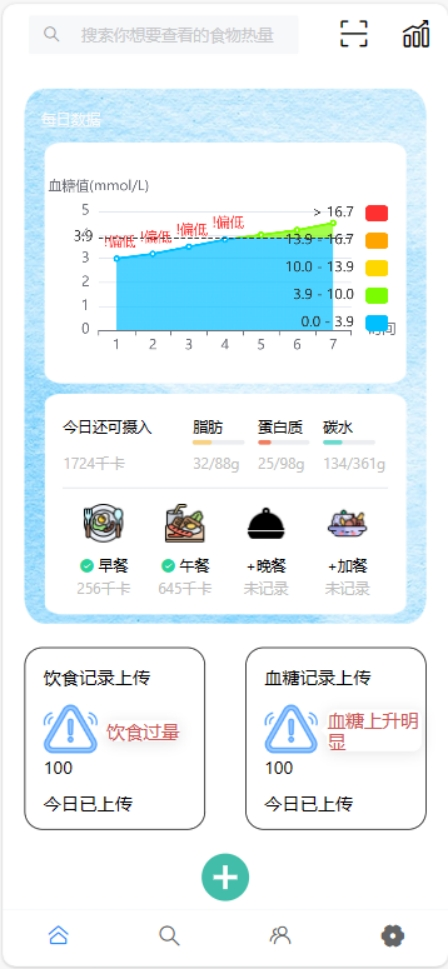 

用户登录后先进入首页。首页顶端设置有搜索框，二维码扫描（待开发）和血糖分析入口。下方折线图为用户近期血糖波动情况。该设计是为了简化用户查询血糖数据操作，使得用户快速掌握近期血糖情况。

下方为饮食记录入口。首先使用《成人糖尿病食养指南2023》和《中国2型糖尿病防治指南》计算出患者当日所能摄入的营养素总量，并以进度条形式展示出患者当日饮食摄入是否超量。

下面为早餐午餐、晚餐、加餐的记录入口。用户每食用一餐并记录后，相应位置将被绿色对勾标记并在下方展示此次用餐摄入的卡路里总量；页面最下方为总的饮食记录上传入口和血糖数据上传入口。此处饮食上传入口与上方不同的是，上方饮食记录上传入口点击后，类型（早午晚加餐）默认已勾选，而下方入口需要用户自行填写。

## ***\*8.3 食谱查询页面\****

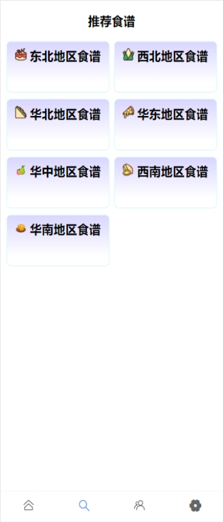 

食谱查询中，我们根据《成人糖尿病食养指南2023》整理了84份官方推荐的食谱。这些食谱的制定结合了中国七大地区的地理特征与四季季节特征，具有科学性，因此我们在这里整理后向患者进行展示推荐。

 

用户可以分季节和地区进行查询。页面顶端提供了季节选择按钮，下方为该季节下的推荐食谱。食谱共分为东北、华北、西北、华中、华东、华南、西南七个大区，和春夏秋冬四个季节，每地区在每季节中有三个推荐食谱。每个食谱中展示了三餐建议饮食及各种食材用量。与此同时还展示了此食谱所含营养物质含量，便于糖尿病患者及时掌握和记录营养摄入情况。

## ***\*8.4 食物查询界面\****

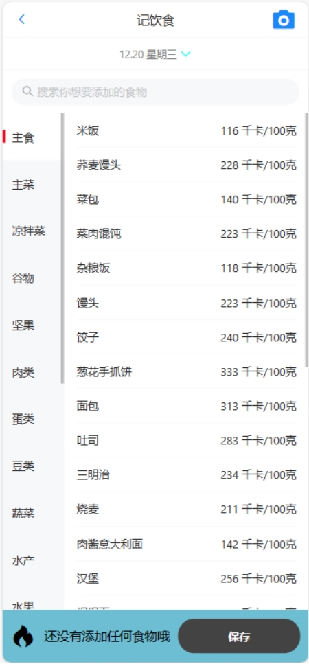 

该页面为食物查询和饮食记录功能共用页面。在这个页面，用户可以看到按类别分类的各种食物以及单位质量的热量含量。用户可以在输入框中输入食物名称进行查询。点击食物即可看到该种食物的营养物质含量。

## ***\*8.5 饮食数据上传界面\****

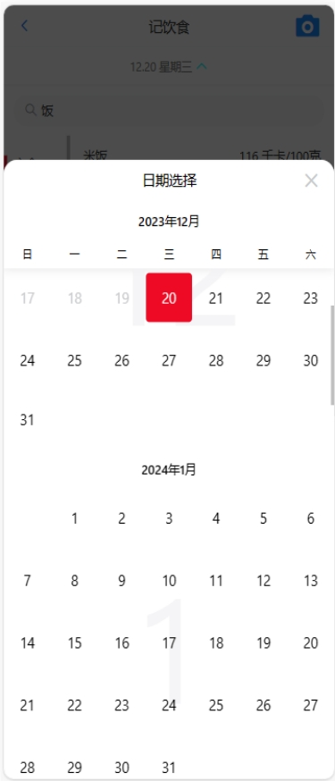 

如果要进行饮食记录，用户首先可以在页面顶端点击日期进行选择。由于用户可能存在补录行为，因此我们在这里设置了日历供用户选择。这样一来用户不仅能够记录当前饮食，也可以补记过去任意一段时间的饮食，增强了用户记录的灵活性。

 

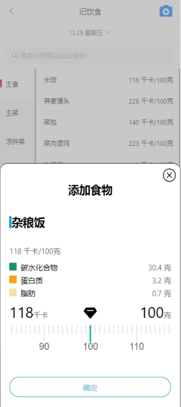 

该页面为用户点击某个食物后的页面。这里默认显示了该食物单位质量所含的热量、碳水化合物质量、蛋白质质量、脂肪质量。下方用刻度尺提供了质量选择功能。用户可以自行拖动刻度条指定该食物的摄入量，并在上方看到实时计算的当前质量食物所蕴含的各种营养物质的预估计算值。

 

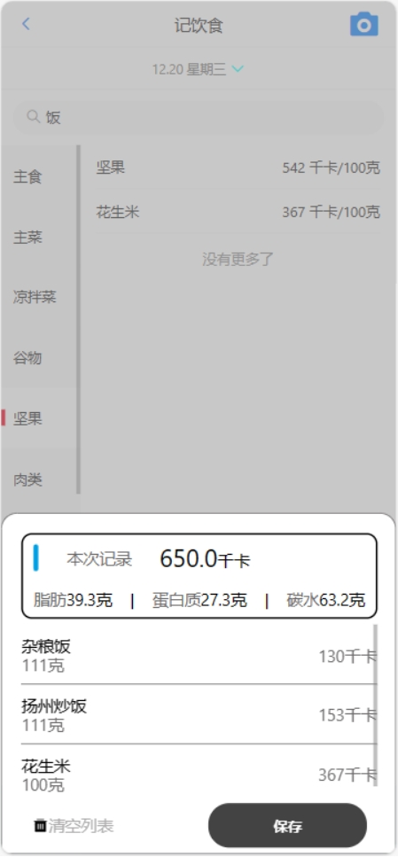 

在选择了若干食物后，页面下方将会以角标和文字的方式显示用户所选择的食物数量，点击后可以查看此餐的统计信息，包括总热量、总蛋白质、脂肪、碳水，以及各种食物分别的质量与能量等。用户点击保存即可将饮食记录加入数据库，点击清空列表即可取消此次选择。

## ***\*8.6 图片上传界面\****

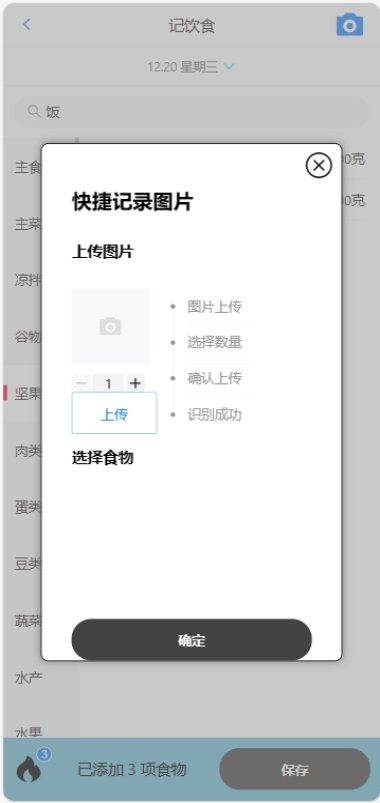 

除了用户手动选择食物，该app主要的一个功能就是与算法对接实现饮食营养的自动评估。该页面是用户上传图片的页面。用户点击相机图标后即可从本地选择一张照片进行上传，之后用户需要点击加减号选择图片中的食物种类数量以便于后端算法进行图像识别。点击上传后，图片将被发往后端，随后根据识别结果返回用户识别信息。在这个界面我们添加了图片上传、选择数量、确认上传、识别成功四步骤流程标注，每完成一个步骤，相应的步骤都会亮起，为用户标识当前当前动作阶段。

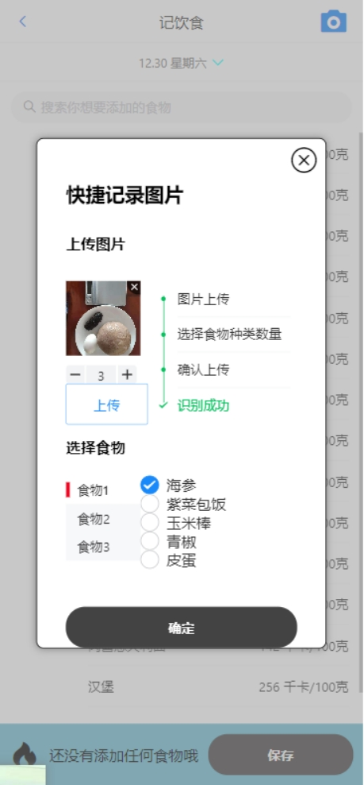 

该界面为用户上传图片并进行图像识别后的结果。算法将会返回给用户每种食物可能性最大的五个选项。用户需要选择和实际情况最吻合的食物种类，以便于进一步实现营养分析。

## ***\*8.7 血糖数据分析界面\****

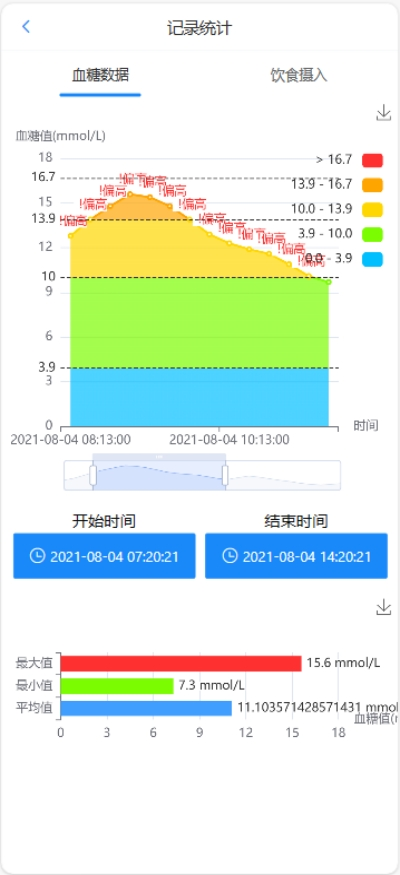 

在血糖数据分析页面，用户可以选择一个时段，页面上将会显示该时段的血糖数据波动图。不同颜色代表血糖值的不同风险范围。我们所需要关注的是折线图散点所处的区间，即色条顶部区域。蓝色区间为低血糖，绿色区间为血糖正常，黄色区间为血糖偏高，橙色区间为中度风险，红色区间为高风险。

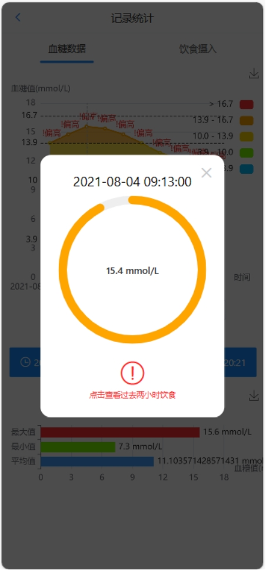 

点击具体的一个血糖记录点可以看到本次血糖记录的记录时间和血糖值。血糖值以16.8mmol/L为满环，用不同颜色标注血糖值对应的风险区间。在这里我们将血糖数据和饮食数据进行了结合。如果当前血糖值过高，我们将允许用户查看过去两小时饮食记录，以便于找出最大可能导致血糖上升的事件。

## ***\*8.8 饮食数据分析界面\****

 

在饮食数据分析界面，用户可以选择一个时间段，查看该时间段内的饮食记录。通过不同色块我们标注了不同餐饮类型。用户点击详情按钮可以看到更为详细的饮食记录。

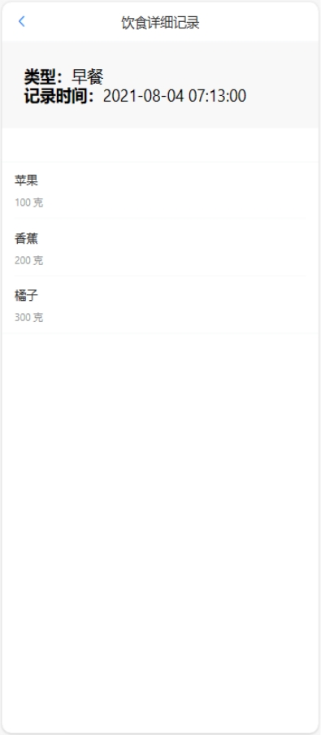 

通过这个页面，用户可以看到具体某一餐里的每一种食物名称、摄入质量，以及各种营养物质含量记录情况。

# ***\*9 导航设计\****

导航设计在我们的软件设计中也起着十分重要的作用。好的导航设计可以大大增加用户体验舒适度，进而增加用户黏性，提高APP的知名度和使用率。

在首页我们设置了桌面式导航，引导用户进行血糖及饮食记录。

 

在顶部导航，使用搜索框及和功能含义相对应的图标进行功能引导。

 

在页面底部，使用标签式底部导航列出首页、食谱查询、数据分析、设置四个页面。

 

在饮食记录和食物查询页面，我们通过顶部导航引导用户选择日期和上传图片

 

使用列表式导航和侧边选择栏引导用户查看食物分类。

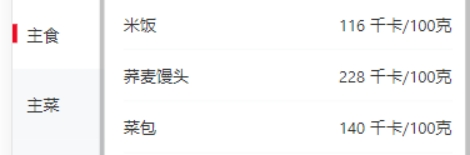 

在食谱查询界面，使用宫格导航引导用户查看食谱信息。

 

在饮食记录中，通过列表式导航引导用户查看饮食详情

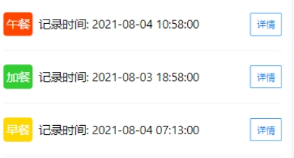 

# ***\*10 非功能设计\****

## ***\*10.1 性能保证\****

在前端使用了nginx来对请求进行负载均衡，提高系统的并发度，确保系统高可用，在后端将服务进行集群化部署确保系统的高可用性。

我们将用户数据保存在Mysql数据库中，能够长期持久化、正确得保存数据，在处理大文件时，使用Minio来作为对象存储服务，将大文件正确存储到磁盘上长期保存。

## ***\*10.2 质量保证\****

我们使用项目组提供的饮食评估算法，确保饮食评估的正确性，通过上海第四人民医院的数据与主任医师指导，确保软件中设计的领域知识准确无误。

我们通过使用Redis来实现单点登录，在确保用户身份信息安全性的同时，保证了在多个服务中重复登录的繁杂问题，提高了用户的使用体验，同时保证了用户的登录信息的一致性性。

## ***\*10.3 安全保障\****

我们使用了基于Sa-Token插件管理用户登录的访问会话，登录成功获取到的令牌有4小时时效性，过期之后失去效果。所有的访问必须经过网关层验证登录的合法性才能被转发给下一层，否则将被直接拦截请求，无法访问到下一层的服务。对于客户端请求必须在验证登录之后才能正确访问，对于密码使用加盐和md5的加密算法提高安全性。这样一来可以确保不会泄露用户的个人信息、病历信息、饮食数据等敏感信息，并且防止未经授权的访问，因为只有经过授权的用户才能够访问和操作系统中的数据和信息。

## ***\*10.4 可维护性设计\****

\1. 文档设计：我们编写了规范、完整、准确的文档，包括需求文档、设计文档等，方便系统的开发、测试和维护。

\2. 标准设计：我们在开发中遵循了统一的编码规范、命名规范、注释规范等，保证系统的可读性和可维护性，开发过程中，各项规范符合《阿里巴巴Java开发手册》的规范。

\3. 模块设计： 系统具有良好的模块化设计，我们将系统分解为多个相对独立的模块，降低系统的复杂度和耦合度，提高系统的可理解性和可扩展性，方便对不同功能模块进行单独的更新和维护，降低系统维护的难度。

\4. 日志记录： 每个微服务都保存有内部操作日志，在出现问题时能够通过查看日志发现问题和研究问题的原因。

\5. 高拓展性：使用微服务架构后，可以通过堆叠服务来提高系统的高可用性和高并发性，使用Nacos来对服务进行管理，在服务注册到系统中后，会自动识别和发现服务，并且对服务进行负载均衡。