# 提醒

请在阿里云/腾讯云控制台以及宝塔面板将所要用到的端口放开

微服务间同一个服务器上不要有端口冲突

打包前确保每个.vue文件都有模板结构

```
<template>

  </template>
  
  <script>
  export default {

  };
  </script>
  
  <style scoped>
  </style>
```

不然打包时会报错

# 访问地址

患者端

http://106.14.69.6:8023/

医生端

http://106.14.69.6:3333/

# 前端部署步骤

## 患者端

### 在vscode控制台输入打包命令

```
npm run build
```

注意，打包命令具体用什么要看package.json文件

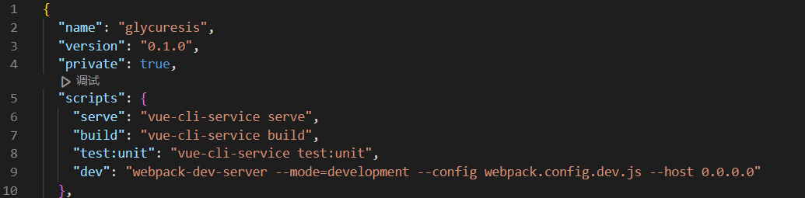

之后会在项目中生成dist文件夹

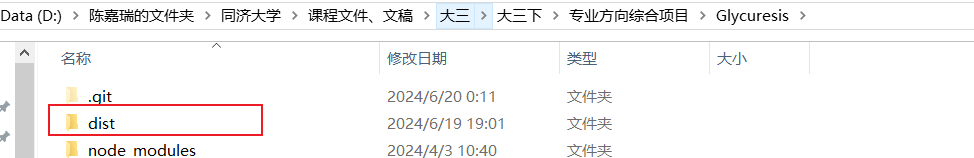

### 放行端口

由于前端所用的是8023端口，所以在部署前端的阿里云服务器控制台以及宝塔面板上放行8023端口（注意，由于这里前端和gateway不在一个服务器上，因此即使都用8023端口也不存在端口冲突）

阿里云防火墙：

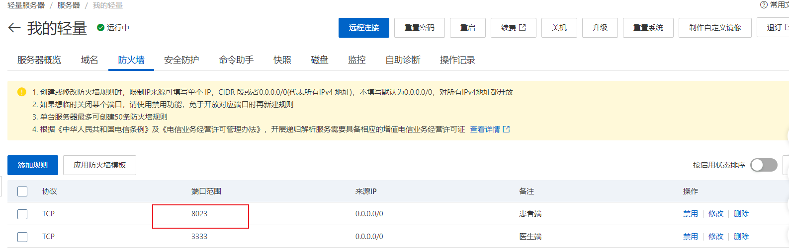

宝塔面板：

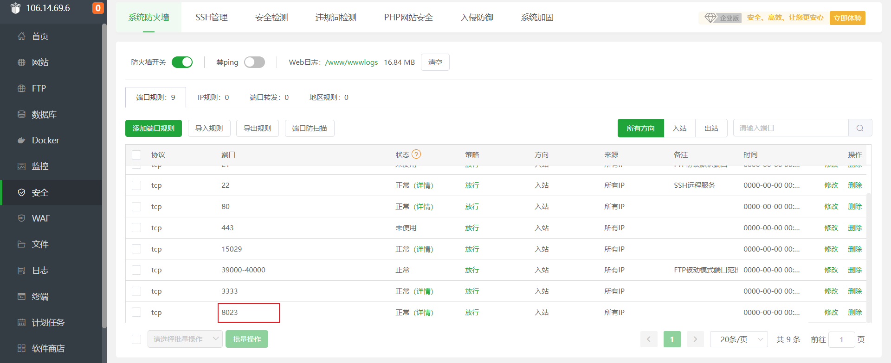

### 上传文件

在www>wwwroot文件夹中建立Glycuresis文件夹

上传dist文件夹

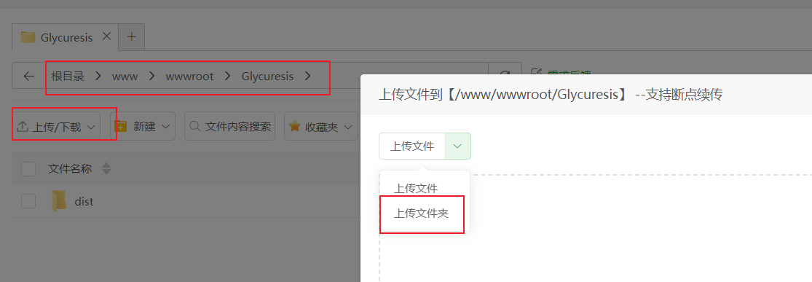

图中有dist文件夹是因为之前已经上传过了

### 添加网站

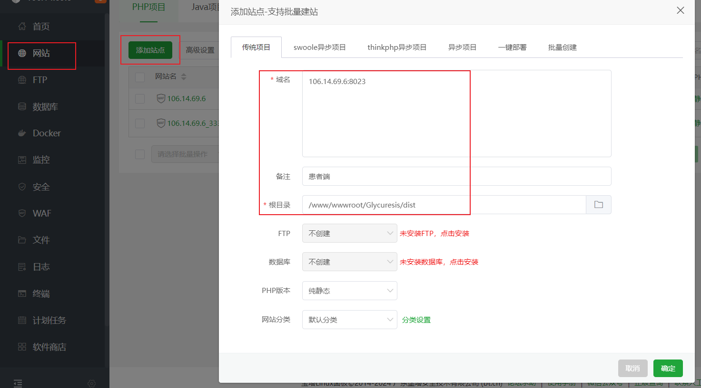

根目录指向dist文件夹，注意域名处要制定端口号

### 解决刷新报错

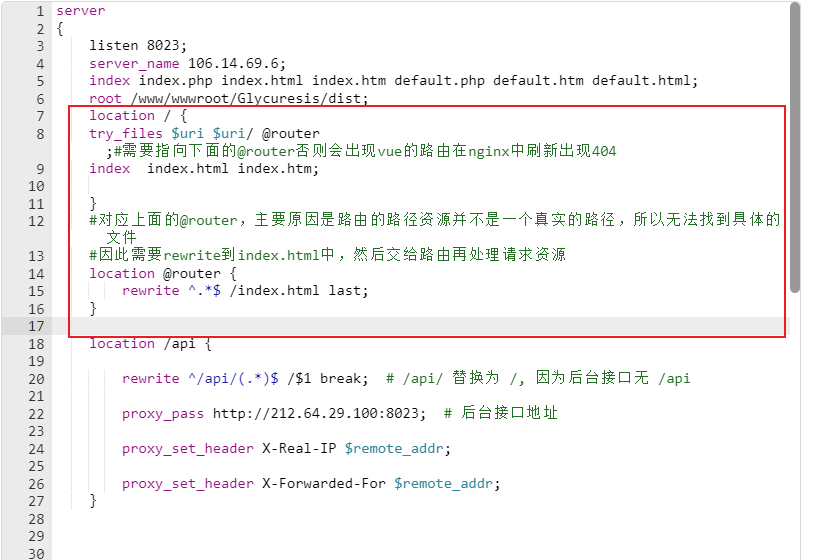

```
    location / {
    try_files $uri $uri/ @router;#需要指向下面的@router否则会出现vue的路由在nginx中刷新出现404
    index  index.html index.htm;
      
    }
    #对应上面的@router，主要原因是路由的路径资源并不是一个真实的路径，所以无法找到具体的文件
    #因此需要rewrite到index.html中，然后交给路由再处理请求资源
    location @router {
        rewrite ^.*$ /index.html last;
    }
```

请求不到资源时重定向到index.html，由vue router接管路由

### 解决跨域请求

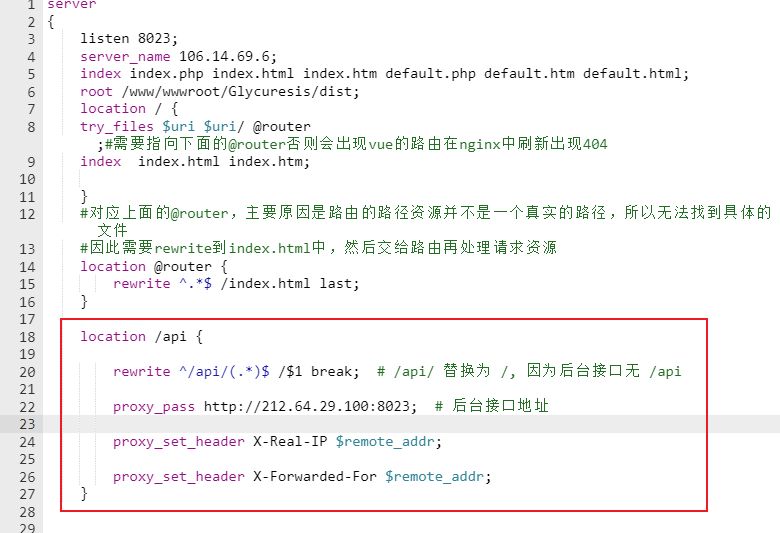

将路由中的/api去掉，并转发到gateway所在服务器8023端口

## 医生端

### 修改路径中的IP

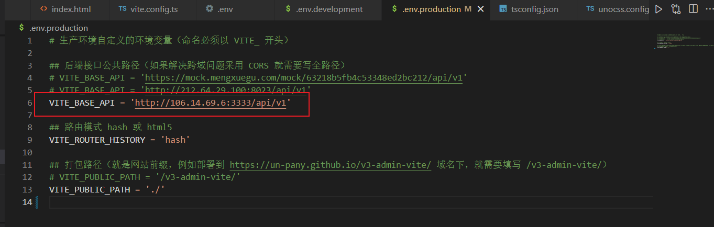

修改生产环境配置文件。这里baseapi的ip要写前端部署的服务器ip:端口或者localhost:端口。不能直接写gateway的地址，因为必须要经过nginx代理转发（即所有请求先打给前端服务器自己，由nginx拦截后转发，不然存在跨域问题）

### 打包

```
pnpm build:prod
```

打包后生成dist文件夹

### 上传文件夹

在www>wwwroot文件夹中建立Glycuresis_Doctor文件夹

上传步骤同患者端

### 添加网站

用3333端口

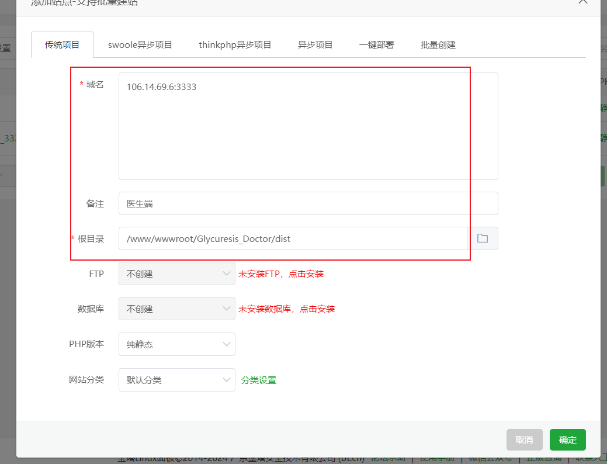

### 解决刷新问题

注意，这里用的是hash模式，因此不存在刷新404问题，跳过

### 解决跨域问题

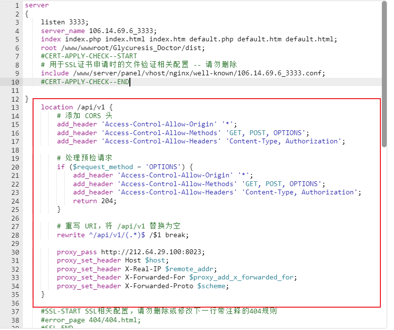

```
    location /api/v1 {
        # 添加 CORS 头
        add_header 'Access-Control-Allow-Origin' '*';
        add_header 'Access-Control-Allow-Methods' 'GET, POST, OPTIONS';
        add_header 'Access-Control-Allow-Headers' 'Content-Type, Authorization';

        # 处理预检请求
        if ($request_method = 'OPTIONS') {
            add_header 'Access-Control-Allow-Origin' '*';
            add_header 'Access-Control-Allow-Methods' 'GET, POST, OPTIONS';
            add_header 'Access-Control-Allow-Headers' 'Content-Type, Authorization';
            return 204;
        }

        # 重写 URI，将 /api/v1 替换为空
        rewrite ^/api/v1/(.*)$ /$1 break;

        proxy_pass http://212.64.29.100:8023;
        proxy_set_header Host $host;
        proxy_set_header X-Real-IP $remote_addr;
        proxy_set_header X-Forwarded-For $proxy_add_x_forwarded_for;
        proxy_set_header X-Forwarded-Proto $scheme;
    }
```


# 后端部署步骤

## 清理

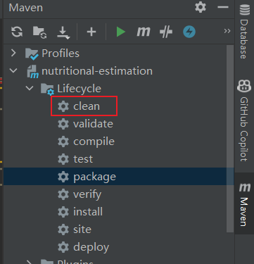

在项目的maven生命周期中点击clean清除之前生成的打包文件

## 打包

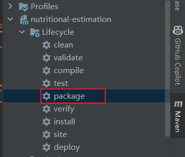

在项目的maven生命周期中点击package进行打包

打包成功结果应如下所示

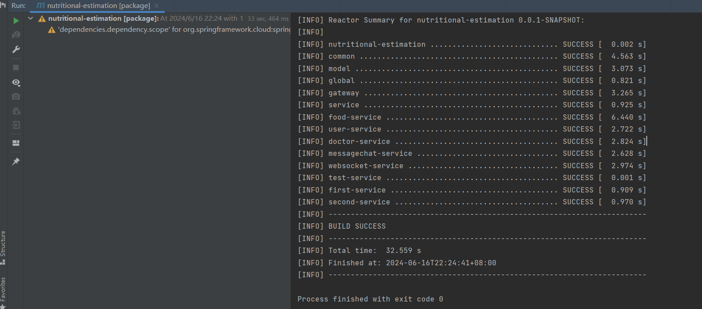

## 上传文件

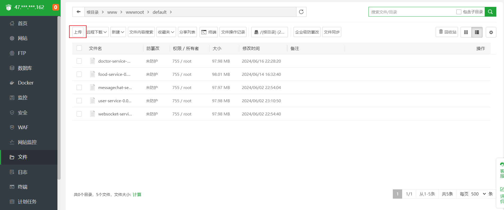

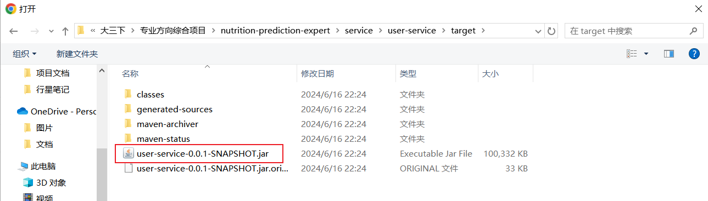

在宝塔的文件页面上传jar包（在项目——service——xx-service(微服务的模块名)——target中）

## 添加springboot项目


在java项目一键部署（没有则需要在软件商店安装）中添加springboot项目，这里需要选择服务器上的jdk绝对路径、服务器ip、项目端口等信息。

选择高级模式，勾选root运行和开机自启动，之后点击确定即可。